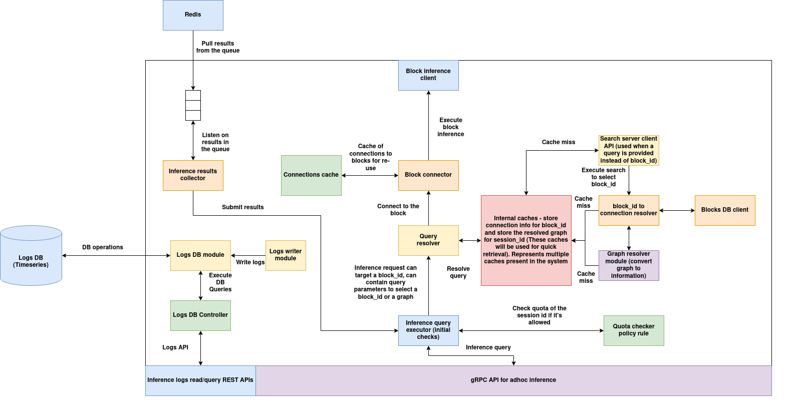

# Global inference server

This server acts as a gateway for submitting tasks to a block or a graph of blocks distributed across multiple clusters within the same network and retrieving the outputs. The global inference server can be deployed anywhere, and developers can set up their own inference servers. The global inference servers registry is used to list all available inference servers across the network, facilitating search and discovery.

### Features
1. Uses the gRPC protocol.  
2. Users can specify a block, define search parameters to select a block, or use a dynamic graph of blocks for inference.  
3. The graph of blocks can span multiple clusters within the same network.  
4. If enabled, all tasks submitted via the gateway can be logged in TimescaleDB (a TimescaleDB URL must be provided).  
5. Anyone can deploy an inference server, provided they have the required infrastructure and a public IP or DNS.  
6. A global registry of ad hoc inference servers enables search and discovery of available inference servers.

---

## Architecture



**High level flow**:

1. An inference task is submitted via the gRPC API. A task has a `session_id`, sequence number, and either a target `block_id` specified or a search query that determines the block. The task can also specify a graph of blocks instead of a single block.

2. A quota check is performed to determine if the request can be allowed using the quota checker policy.

3. If a search query is specified, the `block_id` and the connection information of the block are obtained by performing the search operation and storing the search results in the cache for later use.

4. If a graph is specified along with the task, connection information is obtained for each block and stored in the cache for later use.

5. Inference is executed. The inference results collector waits for the results to be available in the Redis queue. The connection used for inference is saved in the cache so it can be reused.

6. Results are returned to the user.
 
**Components**:

**1. gRPC API**:  
This module provides a gRPC API to submit inference tasks using a well-defined protobuf structure.

**2. Inference query executor**:  
This module takes the inference request and executes the quota checker policy. If the quota check passes, the task is submitted to the query resolver where the next actions are performed. If the quota check fails, an error is returned.

**3. Query resolver**:  
The query resolver takes the task input with the `block_id` specified or with a search query and returns the `block_id`—the target block that should process the task. This module is skipped if the `block_id` is provided. If a search query is specified instead, the module taps into the caching system to obtain the corresponding `block_id` for the `session_id`. If the task input contains a graph of blocks instead of a single block, the module uses the cache to resolve the graph.

**4. Caching system**:  
The caching system is used to support multiple functionalities in the inference server:

a. It contains the `session_id` to `block_id` and `connection_url` mapping cache. This cache reduces the overhead of performing the search again for the same `session_id`. If the input query is specified instead of the `block_id`, a lookup is performed in this cache. On a cache miss, the search query is executed using the similarity search server to obtain the corresponding `block_id` using the specified policy and filter query. The resultant block's data is queried from the blocks DB to obtain the network connection information of the block. The `session_id` → (`block_id`, `connection_url`) is then stored in the cache.

b. It also contains a graph cache used for storing the compiled connection information of all `block_ids` involved in the graph. Iterating over each stage of the graph and obtaining connection information for each block is expensive, so the connection information is saved per `session_id` in the cache for faster lookup.

**5. Block connector and Block client**:  
The block connector establishes either a gRPC or Redis connection to the target block and saves it in the cache. This cache maintains `block_id`: `connection object` entries, enabling reuse of connections instead of establishing new ones. The block client executes the inference task on the target block. The selection between gRPC or Redis depends on the placement of the block and inference server: if the target block is in the same cluster as the inference server, a Redis connection is used; otherwise, a gRPC connection is established.

**6. Inference results collector**:  
Once the blocks complete execution, inference results are pushed into the Redis queue. The inference results collector retrieves these results and returns them to the inference query executor, which then sends them back to the client.

**7. Inference requests logging**:  
This module can be optionally enabled. If enabled, all inference requests are stored in TimescaleDB. The inference logging REST API server provides APIs for querying the logs based on time range and other filter parameters.

---

## gRPC inference guide

Here is the proto structure used for gRPC inference:

```proto
syntax = "proto3";

message AIOSPacket {
    string session_id = 1;  // Session identifier - a unique session_id for each block - useful for stateful inference
    uint64 seq_no = 2;           // Sequence number - the unique sequence number if you are doing sequence / stateful inference
    string data = 4;              // Data (input data - optional)
    double ts = 5;               // Timestamp in unix epoch format (optional)  
    string output_ptr = 6;       // The graph structure (optional - refer the graph structure explanation below)
    repeated FileInfo files = 7; // Array of file structures - each follows FileInfo field (optional)
}

message FileInfo {
    string metadata = 1; // JSON serialized metadata
    bytes file_data = 2; // File data
}

// Define the message structure
message BlockInferencePacket {
    string block_id = 1;         // block_id is optional, the ID of the block (if you are doing a single block inference)
    string session_id = 3;       // Session identifier - a unique session_id for each block - useful for stateful inference
    uint64 seq_no = 4;           // Sequence number - the unique sequence number if you are doing sequence / stateful inference
    bytes frame_ptr = 5;         // Frame pointer (optional - refer to the docs below for explanation)
    string data = 6;              // Data (input data - optional)
    string query_parameters = 7;  // Parameters to use for search (optional if block_id is not specified)
    double ts = 8;               // Timestamp in unix epoch format (optional)
    repeated FileInfo files = 9; // Array of file structures - each follows FileInfo field (optional)
    string output_ptr = 10; // The graph structure (optional - refer the graph structure explanation below)
}

// the inference service
service BlockInferenceService {
    rpc infer(BlockInferencePacket) returns (AIOSPacket);
}
```

Here is the improved and structured version of your data description:

---

### BlockInferencePacket Fields

1. **`block_id`** *(Optional)*  
   - Specifies the ID of the block responsible for executing the task.  
   - Should only be provided if the block is predetermined and fixed.

2. **`session_id`** *(Required)*  
   - A unique identifier representing an inference session.  
   - Enables stateful inference by allowing the block to track the session state.

3. **`seq_no`** *(Required)*  
   - Represents the sequence number of the task within the same `session_id`.  
   - The combination of `(session_id, seq_no)` uniquely identifies a task.  
   - This can be used to ensure inputs are processed in order.

4. **`frame_ptr`** *(Optional)*  
   - Used when the task requires a very large file as input.  
   - Stores file references in Frame DB instead of passing the file directly.  
   - A JSON string containing:  
     - **`framedb_id`**: The ID of the Frame DB.  
     - **`key`**: A unique key identifying the file in Frame DB.

5. **`data`** *(Required)*  
   - Contains the task’s input data.  
   - Typically a JSON string that acts as input for the block.

6. **`query_parameters`** *(Optional)*  
   - An alternative to `block_id` when the target block is not pre-determined.  
   - Contains a JSON string representing a **similarity search** query.  
   - This query is used to select an appropriate block dynamically.  
   - (Refer to the parser documentation for details on similarity search.)

7. **`ts`** *(Required)*  
   - A floating-point UNIX epoch timestamp indicating when the task was created.

8. **`files`** *(Optional)*  
   - A list of small files (e.g., images, audio, PDFs) that the block can use during inference.  
   - Each file should comply with the `FileInfo` struct, containing:  
     - **`metadata`** (Optional): A JSON string with additional metadata about the file.  
     - **`file_data`**: The binary content of the file.

9. **`output_ptr`** *(Optional)*  
   - Used specifically for **graph inference** tasks.  
   - (Refer to the Graph Inference section for further details on this field.)

---

### Inference Examples

#### 1. Inference with specified block_id

```python
import grpc
import time
import inference_pb2
import inference_pb2_grpc

# gRPC Channel to connect with the server
SERVER_ADDRESS = "<server-url>"  

def create_inference_request():
    
    request = inference_pb2.BlockInferencePacket(
        block_id="blk-weugwtns",   # Fixed block ID
        session_id="sess-12345",   # Unique session ID
        seq_no=1,                  # First message in the sequence
        data='''{
            "messages": [
                {"role": "system", "content": "You are a helpful AI assistant."},
                {"role": "user", "content": "How does photosynthesis work?"},
                {"role": "assistant", "content": "Photosynthesis is the process plants use to convert sunlight into energy."},
                {"role": "user", "content": "Can you explain it in simpler terms?"}
            ]
        }''',  # Chat messages with history
        ts=time.time(),  # Current UNIX timestamp
        query_parameters="",  # Not needed since block_id is fixed
        output_ptr="",  # No graph inference
        files=[]  # No files attached
    )
    
    return request

def main():
    """Runs the inference client"""
    # Create a gRPC channel and stub
    channel = grpc.insecure_channel(SERVER_ADDRESS)
    stub = inference_pb2_grpc.BlockInferenceServiceStub(channel)
    
    # Create and send the request
    request = create_inference_request()
    response = stub.infer(request)
    
    # Print the response
    print("Inference Response:")
    print("Session ID:", response.session_id)
    print("Sequence No:", response.seq_no)
    print("Data:", response.data)
    print("Timestamp:", response.ts)
    
if __name__ == "__main__":
    main()

```

#### 2. Inference with block_id and files attached as FileInfo elements

```python
import grpc
import time
import inference_pb2
import inference_pb2_grpc

SERVER_ADDRESS = "<server-url>"

def load_image(file_path):
    """Loads an image as binary data."""
    with open(file_path, "rb") as f:
        return f.read()

def create_object_detection_request():
    """Creates an inference request for object detection with bounding boxes and image files."""
    
    # Example bounding box data in JSON format
    data_json = '''{
        "task": "object_detection",
        "bounding_boxes": [
            {"file_index": 0, "x": 50, "y": 100, "width": 200, "height": 150},
            {"file_index": 1, "x": 30, "y": 60, "width": 180, "height": 140}
        ]
    }'''

    # Load images
    image1 = load_image("image1.jpg")
    image2 = load_image("image2.jpg")

    request = inference_pb2.BlockInferencePacket(
        block_id="blk-xhhwhwu",  # Fixed block ID
        session_id="sess-67890",  # Unique session ID
        seq_no=1,  # First task in sequence
        data=data_json,  # Object detection data with bounding boxes
        ts=time.time(),  # Current timestamp
        query_parameters="",  # Not needed since block_id is fixed
        output_ptr="",  # No graph inference
        files=[
            inference_pb2.FileInfo(metadata='{"file_name": "image1.jpg"}', file_data=image1),
            inference_pb2.FileInfo(metadata='{"file_name": "image2.jpg"}', file_data=image2)
        ]  # Attach image files
    )
    
    return request

def main():
    """Runs the inference client for object detection"""

    # Create a gRPC channel and stub
    channel = grpc.insecure_channel(SERVER_ADDRESS)
    stub = inference_pb2_grpc.BlockInferenceServiceStub(channel)
    
    # Create and send the request
    request = create_object_detection_request()
    response = stub.infer(request)
    
    # Print the response
    print("Inference Response:")
    print("Session ID:", response.session_id)
    print("Sequence No:", response.seq_no)
    print("Data:", response.data)
    print("Timestamp:", response.ts)

if __name__ == "__main__":
    main()

```

#### 3. Inference with query_parameters using similarity search

```python
import grpc
import time
import json
import inference_pb2
import inference_pb2_grpc

SERVER_ADDRESS = "<server-url>"

def create_chat_request():
    """Creates an inference request for LLM chat with history using query_parameters."""
    
    # Example chat message with previous history
    data_json = json.dumps({
        "task": "llm_chat",
        "messages": [
            {"role": "system", "content": "You are an AI assistant."},
            {"role": "user", "content": "Hello! How are you?"},
            {"role": "assistant", "content": "I'm doing well! How can I assist you today?"},
            {"role": "user", "content": "Tell me about black holes."}
        ]
    })

    # Query parameters for selecting the block dynamically - similarity search data
    query_parameters_json = json.dumps({
        "body": {
            "values": {
                "matchType": "cluster",
                "rankingPolicyRule": {
                    "values": {
                        "executionMode": "code",
                        "policyRuleURI": "policies.search.object-det-selector:v0.0.01-stable",
                        "settings": {},
                        "parameters": {
                            "filterRule": {
                                "matchType": "block",
                                "filter": {
                                    "clusterQuery": {
                                        "variable": "id",
                                        "operator": "==",
                                        "value": "cluster-123"
                                    },
                                    "blockQuery": {
                                        "logicalOperator": "AND",
                                        "conditions": [
                                            {
                                                "variable": "component.metadata.algorithmType",
                                                "operator": "==",
                                                "value": "llm"
                                            },
                                            {
                                                "variable": "component.metadata.model",
                                                "operator": "LIKE",
                                                "value": "gpt"
                                            }
                                        ]
                                    }
                                }
                            }
                        }
                    }
                }
            }
        }
    })

    request = inference_pb2.BlockInferencePacket(
        session_id="sess-12345",  # Unique session ID
        seq_no=1,  # First message in sequence
        data=data_json,  # Chat messages history
        ts=time.time(),  # Current timestamp
        query_parameters=query_parameters_json,  # Block selection logic
        output_ptr="",  # No graph inference
        files=[]  # No files attached
    )
    
    return request

def main():
    """Runs the inference client for LLM chat.""" 

    # Create a gRPC channel and stub
    channel = grpc.insecure_channel(SERVER_ADDRESS)
    stub = inference_pb2_grpc.BlockInferenceServiceStub(channel)
    
    # Create and send the request
    request = create_chat_request()
    response = stub.infer(request)
    
    # Print the response
    print("Inference Response:")
    print("Session ID:", response.session_id)
    print("Sequence No:", response.seq_no)
    print("Data:", response.data)
    print("Timestamp:", response.ts)

if __name__ == "__main__":
    main()

```

#### 4. Inference with FrameDB by specifying frame_ptr

```python
import grpc
import time
import json
import inference_pb2
import inference_pb2_grpc

SERVER_ADDRESS = "<server-url>:50051"

def create_video_detection_request():
    """Creates an inference request for object detection within a specific video interval."""
    
    # Video processing interval in seconds
    data_json = json.dumps({
        "task": "object_detection",
        "video_interval": {
            "start_time": 90,  # 1 min 30 sec
            "end_time": 210    # 3 min 30 sec
        }
    })

    # FrameDB reference for the video
    frame_ptr_json = json.dumps({
        "framedb_id": "framdb-123",
        "key": "video-abcdef-123"
    })

    request = inference_pb2.BlockInferencePacket(
        block_id="blk-wexaans",  # Fixed block ID
        session_id="sess-67890",   # Unique session ID
        seq_no=1,  # First sequence
        frame_ptr=frame_ptr_json.encode("utf-8"),  # FrameDB reference
        data=data_json,  # Video processing details
        ts=time.time(),  # Current timestamp
        output_ptr="",  # No graph inference output
        files=[]  # No direct file attachments
    )
    
    return request

def main():
    """Runs the inference client for video object detection."""
    # Update with actual server address

    # Create a gRPC channel and stub
    channel = grpc.insecure_channel(SERVER_ADDRESS)
    stub = inference_pb2_grpc.BlockInferenceServiceStub(channel)
    
    # Create and send the request
    request = create_video_detection_request()
    response = stub.infer(request)
    
    # Print the response
    print("Inference Response:")
    print("Session ID:", response.session_id)
    print("Sequence No:", response.seq_no)
    print("Data:", response.data)
    print("Timestamp:", response.ts)

if __name__ == "__main__":
    main()

```

## Inference using Graphs
Dynamic graphs that spawns across multiple blocks can be created using the dynamic graph syntax below:

```
{
    "parent-block": {
        "outputs": [<child-blocks>]
    },
    .... 
}
```

Example graph:
```
{
    "blk-ksshxpiy": ["blk-bfl3gbd5"],
    "blk-bfl3gbd5": ["blk-tsonq3qr"],
    "blk-tsonq3qr": []
}
```

The above graph represents the connections: `blk-ksshxpiy --> blk-bfl3gbd5 --> blk-tsonq3qr`

Here is a python example of how to use dynamic graphs for inference:

```python
import grpc
import time
import json
import inference_pb2
import inference_pb2_grpc

SERVER_ADDRESS = "<server-url>"

def create_graph_inference_request():
    """Creates an inference request for object detection, tracking, and pose estimation using a dynamic graph."""
    
    # Video processing interval in seconds
    data_json = json.dumps({
        "task": "object_detection_tracking_pose_estimation",
        "video_interval": {
            "start_time": 90,  # 1 min 30 sec
            "end_time": 210    # 3 min 30 sec
        }
    })

    # FrameDB reference for the video
    frame_ptr_json = json.dumps({
        "framedb_id": "framdb-123",
        "key": "video-abcdef-123"
    })

    # Define the dynamic graph
    graph_json = json.dumps({
        "graph": {
            "blk-ksshxpiy": ["blk-bfl3gbd5"],  # Object Detection → Tracking
            "blk-bfl3gbd5": ["blk-tsonq3qr"],  # Tracking → Pose Estimation
            "blk-tsonq3qr": []  # End of pipeline
        }
    })

    request = inference_pb2.BlockInferencePacket(
        block_id="blk-ksshxpiy",  # Head block ID (Object Detection)
        session_id="sess-67890",   # Unique session ID
        seq_no=1,  # First sequence
        frame_ptr=frame_ptr_json.encode("utf-8"),  # FrameDB reference
        data=data_json,  # Video processing details
        ts=time.time(),  # Current timestamp
        output_ptr=graph_json,  # Execution graph
        files=[]  # No direct file attachments
    )
    
    return request

def main():
    """Runs the inference client for object detection + tracking + pose estimation."""
    # Create a gRPC channel and stub
    channel = grpc.insecure_channel(SERVER_ADDRESS)
    stub = inference_pb2_grpc.BlockInferenceServiceStub(channel)
    
    # Create and send the request
    request = create_graph_inference_request()
    response = stub.infer(request)
    
    # Print the response
    print("Inference Response:")
    print("Session ID:", response.session_id)
    print("Sequence No:", response.seq_no)
    print("Data:", response.data)
    print("Timestamp:", response.ts)

if __name__ == "__main__":
    main()

```

## Requests Logging
Request logs if enabled are stored in a timescale DB table with this format:

```sql
CREATE TABLE IF NOT EXISTS block_inference (
                request_id UUID PRIMARY KEY,
                session_id TEXT,
                block_id TEXT,
                seq_no INTEGER,
                ts TIMESTAMPTZ,
                frame_ptr BYTEA,
                data BYTEA,
                query_parameters BYTEA,
                output_ptr BYTEA,
);
```

A timeseries index is built over the `ts` column:
```sql
SELECT create_hypertable('block_inference', 'ts', if_not_exists => TRUE);
```

Files are not logged/saved due to the storage constraints.

### Request logging APIs
Global inference server provides APIs to query the stored logs, some of these APIs are as follows:

### **Get Logs by `session_id`**  
- Retrieves all logs for a given session.  

#### **`cURL` Command:**  
```sh
curl -X GET "<server-url>/logs/session/<session_id>"
```

---

### **Get Logs by `request_id`**  
- Fetches log records associated with a specific request.  

#### **`cURL` Command:**  
```sh
curl -X GET "<server-url>/logs/request/<request_id>"
```

---

### **Get Logs by `block_id`**  
- Retrieves all logs linked to a specific block execution.  

#### **`cURL` Command:**  
```sh
curl -X GET "<server-url>/logs/block/<block_id>"
```

---

### **Get Logs by `session_id` and `block_id`**  
- Fetches logs filtered by both session and block ID.  

#### **`cURL` Command:**  
```sh
curl -X GET "<server-url>/logs/session_block?session_id=<session_id>&block_id=<block_id>"
```

---

## Inference Server Registry
The Inference Server Registry is used to list all inference servers for search and discovery purposes. Users can add their inference servers to this global registry if they want them to be publicly accessible.

### Schema:

Here is the data-class used to represent the inference server in inference server registry:

```python
@dataclass
class InferenceServer:
    inference_server_id: str = field(default_factory=lambda: str(uuid.uuid4()))
    inference_server_name: str = ''
    inference_server_metadata: Dict[str, str] = field(default_factory=dict)
    inference_server_tags: List[str] = field(default_factory=list)
    inference_server_public_url: str = ''
```

Here's a explanation for each field in the `InferenceServer`:  

1. **`inference_server_id: str`**  
   - A unique identifier for the inference server, generated automatically using `uuid.uuid4()`.  

2. **`inference_server_name: str`**  
   - A human-readable name assigned to the inference server.  

3. **`inference_server_metadata: Dict[str, str]`**  
   - A dictionary storing additional metadata about the server, such as model type, framework, or hardware specifications.  

4. **`inference_server_tags: List[str]`**  
   - A list of tags associated with the inference server, which can help in categorization and searchability.  

5. **`inference_server_public_url: str`**  
   - A publicly accessible URL where users can interact with the inference server.


## Inference server registry APIs

Here are all the APIs with updated metadata, where `inference_server_metadata` represents **server location data** (e.g., region, availability zone, provider, etc.).  

---

### **1. Register an Inference Server**
**Endpoint:**  
`POST /inference_server`  

**Description:**  
Registers a new inference server in the system.  

#### **Example Request**
```sh
curl -X POST <server-url>/inference_server \
     -H "Content-Type: application/json" \
     -d '{
           "inference_server_name": "inference-server-us-east-1",
           "inference_server_metadata": {
               "region": "us-east-1",
               "availability_zone": "us-east-1a",
               "provider": "AWS",
               "cluster_id": "cluster-123",
               "quota_management_data": {
                    "requests_per_second_total": 100,
                    "requests_per_second_per_session": 10,
                    "requests_per_second_per_block_id": 10,
                    "requests_per_session_id": 1000,
                    "requests_per_block_id": 100
                }
           },
           "inference_server_tags": ["NLP", "Transformer", "BERT"],
           "inference_server_public_url": "https://us-east-1.inference.example.com"
         }'
```

---

### **2. Get an Inference Server**
**Endpoint:**  
`GET /inference_server/<server_id>`  

**Description:**  
Fetches details of a specific inference server by its ID.  

#### **Example Request**
```sh
curl -X GET <server-url>/inference_server/d4e8c3f0-7c8d-4a2e-b23e-2d4b6789abcd
```

---

### **3. Update an Inference Server**  
**Endpoint:**  
`PUT /inference_server/<server_id>`  

**Description:**  
Updates an inference server’s details using mongo DB update format.  

#### **Example Request: Change Region & Provider**
```sh
curl -X PUT <server-url>/inference_server/d4e8c3f0-7c8d-4a2e-b23e-2d4b6789abcd \
     -H "Content-Type: application/json" \
     -d '{
           "$set": {
               "inference_server_metadata.region": "us-west-2",
               "inference_server_metadata.provider": "Google Cloud"
           }
         }'
```

#### **Example Request: Add a New Tag**
```sh
curl -X PUT <server-url>/inference_server/d4e8c3f0-7c8d-4a2e-b23e-2d4b6789abcd \
     -H "Content-Type: application/json" \
     -d '{
           "$push": {
               "inference_server_tags": "LLM"
           }
         }'
```

---

### **4. Delete an Inference Server**
**Endpoint:**  
`DELETE /inference_server/<server_id>`  

**Description:**  
Deletes an inference server from the registry.  

### **Example Request**
```sh
curl -X DELETE <server-url>/inference_server/d4e8c3f0-7c8d-4a2e-b23e-2d4b6789abcd
```

---

### **5. Query Inference Servers**  
**Endpoint:**  
`POST /inference_servers`  

**Description:**  
Retrieves a list of inference servers matching specific criteria using MongoDB-style queries.  

---

#### **Example Query: Find All Servers in `us-east-1a` Using GPUs**
```sh
curl -X POST <server-url>/inference_servers \
     -H "Content-Type: application/json" \
     -d '{
           "inference_server_metadata.availability_zone": "us-east-1a",
           "inference_server_metadata.gpu_available": true
         }'
```

---

#### **Example Query: Find All Servers Hosted on AWS**
```sh
curl -X POST <server-url>/inference_servers \
     -H "Content-Type: application/json" \
     -d '{
           "inference_server_metadata.provider": "AWS"
         }'
```

---

#### **Example Query: Find Servers With NLP or LLM Tags**
```sh
curl -X POST <server-url>/inference_servers \
     -H "Content-Type: application/json" \
     -d '{
           "inference_server_tags": { "$in": ["NLP", "LLM"] }
         }'
```

---

#### **Example Query: Find Servers Registered After `2025-01-01`**
```sh
curl -X POST <server-url>/inference_servers \
     -H "Content-Type: application/json" \
     -d '{
           "registered_at": { "$gte": "2025-01-01T00:00:00Z" }
         }'
```

---

#### **Summary of API Endpoints**
| Method | Endpoint | Description |
|--------|----------|-------------|
| `POST` | `/inference_server` | Create a new inference server |
| `GET` | `/inference_server/<server_id>` | Get details of a specific inference server |
| `PUT` | `/inference_server/<server_id>` | Update an inference server using MongoDB format |
| `DELETE` | `/inference_server/<server_id>` | Delete an inference server |
| `POST` | `/inference_servers` | Query inference servers with filters |

---
