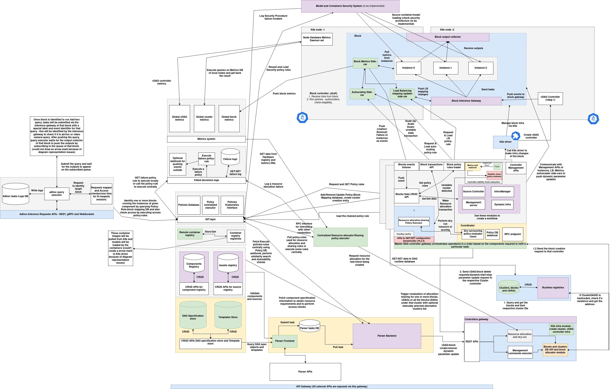

# Architecture

([Download the architecture diagram](./assets/aios-all-arch.drawio.png))

## Component Descriptions

### Management Services

#### **Parser**

The Parser service acts as a gateway to create blocks, vDAGs, registry components, and clusters by submitting a specification JSON document. It applies a default standard specification but also allows users to define their own using templates from the registry and the policy system.

[Documentation for Parser](./parser/parser.md)

#### **Cluster Controller Gateway**

The Cluster Controller Gateway manages clusters within a network. It initializes cluster infrastructure, schedules blocks (in coordination with the target cluster's controller), and acts as a proxy to execute management commands for blocks and clusters. It also handles configuration tweaks for policies, vDAG controller infrastructure setup, and pre-check policy implementations.

[Documentation for Cluster Controller Gateway](./cluster-controller-gateway/cluster-cotroller-gateway.md)

#### **Resource Allocator**

The Resource Allocator executes resource allocation policies. The Cluster Controller Gateway uses it to determine the appropriate cluster, node, and GPUs for block scheduling. Users can also perform manual dry-runs to identify the optimal deployment targets.

[Documentation for Resource Allocator](./resource_allocator/resource-allocator.md)

#### **Policies System**

The Policies System includes a database, registry service, executors, and Kubernetes interfaces. It allows storing, loading, querying, and executing policies, or deploying them as jobs or remote functions.

[Documentation for Policies System](./policies-system/policies-system.md)

#### **Spec and Template Registries**

These registries store pre-built specifications and custom parser templates. The Parser service uses them to invoke custom templates for parsing and validation. Users can also query available specifications and templates.

[Documentation for Template Registry](./spec-template-store/template-store.md)  
[Documentation for Spec Registry](./spec-template-store/spec-store.md)

#### **Container Registry**

The Container Registry provides a distributed system for storing container images across clusters and remote machines. It maintains a central index to enable discovery and upload of container images.

[Documentation for Container Registry](./container-registry/container-registry.md)

#### **Assets Registry**

The Assets Registry stores various types of assets used by applications, including policy code archives, model files, images, videos, etc. These assets can be referenced within blocks. Similar to the container registry, it is distributed and can be hosted on any cluster or remote machine with object storage. The Assets DB Registry provides a centralized index of available asset registries.

[Documentation for Assets Registry](./assets-db-registry/assets-db-registry.md)

#### **Components Registry**

The Components Registry stores components that can be initialized as blocks. Each component includes references to the AIOS instance container image, any sidecar container images, metadata such as author information, input/output templates, default parameters, and settings.

#### **Adhoc Inference Servers Registry**

Inference servers can be deployed on any cluster. The Adhoc Inference Servers Registry maintains a list of all deployed inference servers, their public endpoints, and metadata, allowing users to discover and submit inference tasks.

[Documentation for Adhoc Inference Servers Registry](./adhoc-inference-server/adhoc-inference-server.md)

#### **Metrics System**

The Metrics System includes metrics collectors, local cluster-level metrics storage, and a centralized global metrics database. It collects and stores metrics from nodes, block instances, and vDAG controllers.

[Documentation for Metrics System](./metrics-system/metrics-system.md)

---

### Cluster Services

#### **Cluster Controller**

The Cluster Controller allocates blocks, provisions resources, monitors deployments and node health, and interacts with the Cluster Controller Gateway for initial scheduling.

[Documentation for Cluster Controller](./cluster-controller/cluster-controller.md)

#### **Cluster Local Metrics System**

The Cluster Local Metrics System includes hardware metric daemons on each node, along with local databases to store metrics related to blocks, clusters, and vDAGs for efficient querying.

[Documentation for Metrics System](./metrics-system/metrics-system.md)

---

## Application Layer

#### **Block**

A Block is an instance of a component deployed using a container image built with the AIOS SDK. Blocks can be deployed on any cluster in the network. The SDK supports building custom computational logic for execution as a block. Each block includes services like auto-scaling, load balancing, health checking, and metrics integration for effective management and monitoring.

[Documentation for Block](./block/block.md)

#### **Adhoc Inference Server**

Inference or general computational tasks can be submitted to blocks via inference servers. These servers can be deployed on any cluster and registered for public discovery through the registry.

[Documentation for Adhoc Inference Server](./adhoc-inference-server/adhoc-inference-server.md)

#### **vDAG and vDAG Controller**

A vDAG (virtual Directed Acyclic Graph) spans multiple blocks across the network. The vDAG Controller enables submission of vDAG inference tasks and provides mechanisms for health checks, quota management, and quality audits via policies.

[Documentation for vDAG Controller](./vdag-controller/vdag-controller.md)

#### **LLM System**

The LLM System supports deploying large language models as blocks using the AIOS LLM SDK, which builds upon the base AIOS SDK. It allows model splitting and deployment across multiple nodes or clusters using the vDAG pipeline parallelism approach.

[Documentation for LLM Block Instance](./llm-docs/llm-method-1.md)  
[Documentation for LLM Model Splitting and Deployment](./llm-docs/llm-model-splits.md)

#### **Third-Party System Integration**

Blocks can integrate with third-party services, whether external or internal to the network. These services can be deployed independently or co-located with blocks using init containers to ensure they start within the same cluster environment.

[Documentation for Third-Party Blocks](./llm-docs/third-party-blocks.md)

---

## Index:

## 1. Getting Started
1.1 [Installation](installation/installation.md)  
1.2 [Onboarding Cluster](onboarding-notes/onboarding-cluster.md)  
1.3 [Onboarding Node to a Cluster](onboarding-notes/onboarding-node.md)

---

## 2. Management Services

### 2.1 Parser
2.1.1 [Parser Introduction](parser/parser.md)  
2.1.2 [Creating a Block](parser/block.md)  
2.1.3 [Creating a Cluster](parser/cluster.md)  
2.1.4 [Creating a Component](parser/component.md)  
2.1.5 [Creating vDAGs](parser/vdag.md)  
2.1.6 [Executing Management Commands](parser/mgmt-commands.md)  
2.1.7 [Filtering and Search](parser/search-server.md)

### 2.2 Other Services
2.2.1 [Policies-System](policies-system/policies-system.md)  
2.2.2 [Cluster-Controller-Gateway](cluster-controller-gateway/cluster-cotroller-gateway.md)  
2.2.3 [Resource Allocator](resource_allocator/resource-allocator.md)  
2.2.4 [Failure Policy Executor](failure-policy-server/failure-policy-server.md)  
2.2.5 [Tasks Tracking and Tasks DB](global-tasks-db/global-tasks-db.md)

---

## 3. Registries

### 3.1 Specification Registries
3.1.1 [Spec Store](spec-template-store/spec-store.md)  
3.1.2 [Template Store](spec-template-store/template-store.md)

### 3.2 Assets, Container Registries and Components Registry:
3.2.1 [Assets Registry](assets-db-registry/assets-db-registry.md)  
3.2.2 [Container Registry](container-registry/container-registry.md)
3.3.3 [Component Registry](db-registries/component-registry.md)

### 3.3 Runtime Registries
3.3.1 [Introduction](db-registries/runtime-db-registries.md)  
3.3.2 [Clusters Registry](db-registries/cluster-registry.md)  
3.3.3 [Block Registry](db-registries/block-registry.md)  
3.3.4 [vDAG Registry](db-registries/vdag-registry.md)

---

## 4. Cluster Services
4.1 [Cluster Controller](cluster-controller/cluster-controller.md)  
4.2 [Metrics System](metrics-system/metrics-system.md)

---

## 5. Application Layer
5.1 [Block](block/block.md)  
5.2 [AIOS Instance SDK](aios-instance/aios-instance.md)  
5.3 [Inference Server](adhoc-inference-server/adhoc-inference-server.md)  
5.4 [vDAG Controller](vdag-controller/vdag-controller.md)

### 5.5 LLM Ecosystem
5.5.1 [Method-1: LLM SDK](llm-docs/llm-method-1.md)  
5.5.2 [Method-2: Model Splitting and Distributed Inference](llm-docs/llm-model-splits.md)  
5.5.3 [Third-party System Integration](llm-docs/third-party-blocks.md)

---
