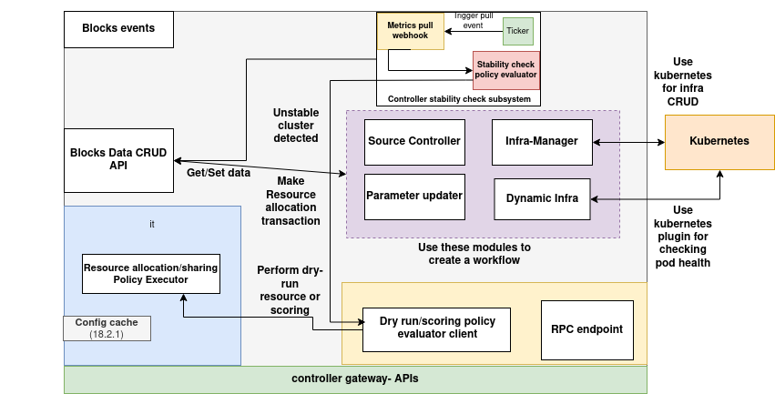

# Cluster Controller

The **Cluster Controller** is a suite of services deployed by default on each cluster. It is responsible for orchestrating and managing the lifecycle of blocks running within the cluster. Additionally, it handles the onboarding and deboarding of nodes, monitors the health of both nodes and pods, and ensures high availability through automated failure recovery mechanisms.

---

## Core Responsibilities

1. Provisioning and decommissioning block infrastructure within the cluster.
2. Acting as a proxy for executing administrative and management commands on blocks.
3. Allocating compute and storage resources for newly spawned instances due to auto-scaling events.
4. Coordinating with the `cluster-controller-gateway` during the initial resource provisioning phase for blocks.
5. Deploying and tearing down vDAG controller infrastructure.
6. Scaling vDAG controller components as needed.
7. Onboarding and de-boarding of cluster nodes.
8. Continuous health monitoring of cluster nodes and pods, with automatic reassignment of workloads in case of node failure.
9. Enforcing policy validations prior to infrastructure changes such as block creation/removal and node addition/removal.

---

## Architecture



([Download the architecture diagram](../assets/cluster-controller-arch.png))

---

### Components of the Cluster Controller

**1. Blocks Data CRUD API**  
This module acts as the interface between the Cluster Controller and the Blocks Database, which serves as a centralized registry of all blocks deployed across the cluster. It provides standardized CRUD operations, facilitating interaction with block metadata for internal modules.

**2. Block Events Processor**  
Deployed as a container within the Cluster Controller pod, this module is responsible for executing policies tied to specific block-triggered events. It ensures that the system reacts in compliance with governance rules.

**3. Dry-Run & Resource Allocator**  
This component is responsible for computing and allocating the necessary resources to block instances during both initial deployment and scaling operations. It evaluates and executes the block’s resource allocation policy, optionally supporting dry-run simulations for validation.

**4. Infrastructure Management Module**  
The central component responsible for interfacing with the Kubernetes API to manage the lifecycle of infrastructure resources associated with blocks and vDAG controllers. It also enforces policy-based pre-checks to authorize critical actions before execution.

**5. Dynamic Infrastructure Scanner**  
This module performs periodic health assessments of all block instance pods within the cluster. Upon detecting anomalies or failures, it alerts the Infrastructure Management module, which in turn triggers automated remediation—such as rescheduling pods to healthy nodes using fresh resource allocation plans.

**6. Source Controller**  
The Source Controller is tasked with scheduling and managing GStreamer-based video ingestion streams for inference workloads.

**7. Management Command Executor**  
This module serves as a proxy for routing management commands to specific blocks or their components. It performs authorization checks via pre-defined policies to validate and authorize actions before dispatching them for execution.

**8. Stability Checker**  
Responsible for executing the cluster stability policy, this module analyzes data from the Dynamic Infrastructure Scanner to assess the operational state of the cluster. It can be configured to trigger external webhooks or notification systems in the event of anomalies.

---

## Pre-check Policies

**Pre-check policies** are customizable rule sets, authored in Python, that evaluate and authorize actions prior to their execution. These policies serve as a governance mechanism, enabling cluster administrators and developers to enforce cluster-specific constraints and compliance rules.

By implementing pre-check policies, the system ensures that only authorized operations are performed.

The **Cluster Controller** currently supports the following action-level policy hooks:


| **Action**               | **Description**                                                                 |
|--------------------------|---------------------------------------------------------------------------------|
| `add_node`               | Validates whether a new node can be added to the cluster.                      |
| `remove_node`            | Determines if a node is eligible for safe removal from the cluster.            |
| `update_cluster`         | Governs modifications to cluster-wide configurations or metadata.              |
| `scale_block`            | Checks authorization and constraints before scaling block instances.           |
| `add_block`              | Validates if a new block can be provisioned based on policy rules.             |
| `remove_block`           | Ensures safe and policy-compliant decommissioning of a block.                  |
| `add_vdag_controller`    | Authorizes creation of vDAG controller infrastructure.                         |
| `remove_vdag_controller` | Validates and controls teardown of vDAG controller components.                 |
| `block_mgmt`             | Enforces policy rules for administrative actions executed on blocks.           |
| `cluster_mgmt`           | Applies constraints on high-level cluster management operations and commands.  |

---

### Writing a pre-check policy:

The pre-check policy rule should return a dict containing following fields: 

```python
{ 
    "allowed": True, 
    "input_data": input_data  # the modified input data, if not return the input data as it is
} 
```

If not allowed:
```python
{ 
    "allowed": False, 
    "input_data": <message or dict containing the reason data of why the action was not allowed> 
} 
```

The Boolean key `allowed` tells whether the execution of the given action should proceed or not, also the input_data that is passed to the policy rule can be tweaked by the pre-check policy rule, thus the input_data field should contain the updated version of the input dictionary passed to the policy rule, if no modifications are made, return the input_data as it is in this field. Here is the structure of the policy rule that can be used as a pre-check: 

```python
class AIOSv1PolicyRule: 

    def __init__(self, rule_id, settings, parameters): 

        """ 
            Initializes an AIOSv1PolicyRule instance. 
            Args: 
            rule_id (str): Unique identifier for the rule. 
            settings (dict): Configuration settings for the rule. 
            parameters (dict): Parameters defining the rule's behavior. 

        """ 
        self.rule_id = rule_id 
        self.settings = settings 
        self.parameters = parameters
    
    def eval(self, parameters, input_data, context): 

        """ 
            Evaluates the policy rule. 
            This method should be implemented by subclasses to define the   rule's logic.  
            It takes parameters, input data, and a context object to perform  evaluation. 
            Args: 
                parameters (dict): The current parameters. 
                input_data (any): The input data to be evaluated. 
                context (dict): Context (external cache), this can be used for  storing and accessing the state across multiple runs. 
        """ 
        # the input_data dict can be modified by the policy 
        # make input_data dict modifications here 

        return { 
            "allowed": True, 
            "input_data": input_data 
        } 

```

---

### add_vdag_controller input data

```json
{
    "vdag_data": {},
    "cluster_data": {},
    "cluster_metrics": {},
    "node_id": "",
    "input_data": {}
}
```

### remove_vdag_controller input data

```json
{
    "vdag_data": {},
    "vdag_controller_data": {},
    "cluster_data": {},
    "cluster_metrics": {},
    "node_id": ""
}
```

---

## Cluster controller components API documentation:
### Infra-management APIs:

Infra-management APIs are responsible for executing cluster infra related actions like creating a block, removing a block, scaling a block in the cluster, creating a vDAG controller, removing a vDAG controller, adding a node to the cluster, removing a node from the cluster, querying cluster data etc. 

#### Block Actions API:
Block action APIs are responsible for adding/removing/scaling/re-assigning blocks, these APIs are used by the internal systems and most of these actions are called through cluster-controller gateway, so **these APIs are not recommended to be called directly by the user**.

**Endpoint:** `/executeAction`  
**Method:** `POST`  
**Description:**  

This endpoint is part of the action execution server. It accepts a request containing an action and its associated data, processes it through the `Router` logic, and returns the result of the action.

**Example curl Command:**

```bash
curl -X POST http://<server-url>/executeAction \
  -H "Content-Type: application/json" \
  -d '{
    "action": "<your-action>",
    "data": {}
  }'
```

Here is the list of actions supported:
| Action                     | Description                                                                 | Used by |
|----------------------------|-----------------------------------------------------------------------------|---------|
| `remove_block`             | Removes a specified block from the system.                                  |   Cluster controller gateway      |
| `create_block`             | Creates a new block with the provided configuration.                        |  Cluster controller gateway        |
| `parameter_update`         | Updates parameters of an existing component or block.                       |    Management Command Executor      |
| `scale`                    | Handles scaling events to adjust the number of instances.                   |     Auto-scaler of the block and the Cluster controller gateway    |
| `dry_run`                  | Simulates an operation without actually performing it (for validation).     |     Cluster controller gateway    |
| `remove_instance`          | Removes a specific instance from the system.                                |   Cluster controller gateway      |
| `init_create_status_update`| Updates the status during the initialization phase of a container.          |    Cluster controller gateway (Refer **LLM Support** documentation)
| `query_init_container_data`| Queries the current status or data from the init container phase.           |    Cluster controller gateway (Refer **LLM Support** documentation)    |
| `reassign-instances`       | Reassigns instances between blocks or components for load balancing.        |    Dynamic Infrastructure Scanner (internal module)       |

---

#### vDAG controller actions API:
vDAG controller APIs are responsible for creating/removing/scaling vDAG controller on the cluster.

**Endpoint:** `/vdag-controller`  
**Method:** `POST`  
**Description:**  

This endpoint manages vDAG controllers by handling creation, scaling, listing, and deletion. Actions are specified via the `action` field in the request body. The supported actions include creating a controller, scaling it, removing it, and listing all controllers. Fields like `cluster_id` and `public_url` are assigned internally during controller creation.

**Example curl Command:**

```bash
curl -X POST http://<server-url>/vdag-controller \
  -H "Content-Type: application/json" \
  -d '{
    "action": "create_controller",
    "payload": {
      "vdag_controller_id": "vdag-controller-123", 
      "vdag_uri": "<vdag-uri>",
      "config": {
        "policy_execution_mode": "local",
        "replicas": 2
      },
      "search_tags": []
    }
  }'
```

Supported actions:

| Action              | Description                                                                 | Payload Example                                                                                                      | Used by                 |
|---------------------|-----------------------------------------------------------------------------|----------------------------------------------------------------------------------------------------------------------|--------------------------|
| `create_controller` | Creates a new vDAG controller with the given configuration.                 | `{ "vdag_controller_id": "<id>", "vdag_uri": "<uri>", "config": { "policy_execution_mode": "local", "replicas": 2 }, "search_tags": [] }` | Cluster controller gateway |
| `remove_controller` | Removes an existing vDAG controller and deletes its entry from the database.| `{ "vdag_controller_id": "<id>" }`                                                                                  | Cluster controller gateway |
| `scale_controller`  | Updates the number of replicas for a specified vDAG controller.             | `{ "vdag_controller_id": "<id>", "replicas": 3 }`                                                                   | Cluster controller gateway |
| `list_controllers`  | Returns a list of all deployed vDAG controllers.                            | `{}`                                                                                                                | Cluster controller gateway |                                                        |         |

---

#### Cluster actions APIs (all APIs are used internally - via Cluster controller gateway):
These APIs are used for adding/removing nodes to the cluster, querying or updating the cluster data.

**Endpoint:** `/cluster-actions/add-node`  
**Method:** `POST`  
**Description:**  

Adds a new node to the cluster with the provided node configuration data.

**Example curl Command:**

```bash
curl -X POST http://<server-url>/cluster-actions/add-node \
  -H "Content-Type: application/json" \
  -d '{}'
```

---

**Endpoint:** `/cluster-actions/remove-node/<node_id>`  
**Method:** `DELETE`  
**Description:**  

Removes the specified node from the cluster using its node ID.

**Example curl Command:**

```bash
curl -X DELETE http://<server-url>/cluster-actions/remove-node/<node-id>
```

---

**Endpoint:** `/cluster-actions/get-cluster`  
**Method:** `GET`  
**Description:**  

Retrieves current cluster configuration and node information.

**Example curl Command:**

```bash
curl -X GET http://<server-url>/cluster-actions/get-cluster
```

---

**Endpoint:** `/cluster-actions/update-cluster`  
**Method:** `PATCH`  
**Description:**  

Updates the cluster configuration using the provided data.

**Example curl Command:**

```bash
curl -X PATCH http://<server-url>/cluster-actions/update-cluster \
  -H "Content-Type: application/json" \
  -d '{
    "$set": {
      "tags": ["gpu", "updated"],
      "reputation": 97
    }
  }'
```
---

### Blocks Query APIs:

These APIs are used to query the data of the blocks running in the cluster.

**Endpoint:** `/blocks/<block_id>`  
**Method:** `GET`  
**Description:**  

Retrieves information about a specific block in the cluster using the provided block ID.

**Example curl Command:**

```bash
curl -X GET http://<server-url>/blocks/<block-id>
```

---

**Endpoint:** `/blocks`  
**Method:** `GET`  
**Description:**  

Returns information for all blocks currently present in the cluster.

**Example curl Command:**

```bash
curl -X GET http://<server-url>/blocks
```

---

**Endpoint:** `/blocks/query`  
**Method:** `POST`  
**Description:**  

Performs a filtered query over blocks in the cluster using MongoDB query syntax. This allows advanced filtering using operators like `$in`, `$and`, `$or`, etc.

**Example curl Command:**

```bash
curl -X POST http://<server-url>/blocks/query \
  -H "Content-Type: application/json" \
  -d '{
    "query": {
      "cluster.reputation": { "$gt": 90 },
      "policies.autoscaler.policyRuleURI": { "$ne": "" }
    },
    "options": {
      "sort": { "id": 1 },
      "limit": 10
    }
  }'
```
--- 

### Blocks update API:
This API is used for updating the block data.
```sh
**Endpoint:** `/block/update/<block_id>`  
**Method:** `PUT`  
**Description:**  

Updates the configuration or metadata of an existing block identified by `block_id` using a MongoDB-style update payload (e.g., `$set`, `$unset`, etc.).

**Example curl Command:**

```bash
curl -X PUT http://<server-url>/block/update/<block-id> \
  -H "Content-Type: application/json" \
  -d '{
    "$set": {
        "blockMetadata.description": "Updated description for object detection block",
        "minInstances": 2
    }
  }'
```

---

### Dynamic infra scanner APIs
Dynamic infra scanner module provides the following APIs:

**Endpoint:** `/healthy_nodes`  
**Method:** `GET`  
**Description:**  

Returns a list of healthy nodes in the cluster based on internal health-check metrics.

**Example curl Command:**

```bash
curl -X GET http://<server-url>/healthy_nodes
```

---

**Endpoint:** `/nodes_status`  
**Method:** `GET`  
**Description:**  

Returns the health status of all nodes in the cluster, including healthy and unhealthy ones.

**Example curl Command:**

```bash
curl -X GET http://<server-url>/nodes_status
```
---

### Stability checker APIs:
Stability checker module provides following APIs:

**Endpoint:** `/check_stability`  
**Method:** `GET`  
**Description:**  

Triggers a cluster-wide stability check using the current status of all nodes. Evaluates whether the cluster is in a stable and healthy state using stability checker policy.

**Example curl Command:**

```bash
curl -X GET http://<server-url>/check_stability
```

---

**Endpoint:** `/mgmt`  
**Method:** `POST`  
**Description:**  

This endpoint is part of the stability checker policy management system. This API can execute management commands against the policy being used as stability checker.

**Example curl Command:**

```bash
curl -X POST http://<server-url>/mgmt \
  -H "Content-Type: application/json" \
  -d '{
    "mgmt_action": "<action>",
    "mgmt_data": {}
  }'
```

---

### Management Command Executor APIs:
Management command executor provides the following API:

**Endpoint:** `/mgmt`  
**Method:** `POST`  
**Description:** 

This API can be used to execute management command/s against block's services or the cluster controller gateway's stability checker.

Executes a management action on a specified service of a block if `block_id` is provided. The target service and action must be provided, along with any optional data required to perform the operation.

If `block_id` is not provided and `service` is `stability_checker` then the management command is executed against the cluster controller's stability checker module.

**Example curl Command:**

```bash
curl -X POST http://<server-url>/mgmt \
  -H "Content-Type: application/json" \
  -d '{
    "block_id": "",
    "service": "stability_checker",
    "mgmt_action": "<action>",
    "mgmt_data": {}
  }'
```

| Management Service | Description                                                                                  |
|--------------------|----------------------------------------------------------------------------------------------|
| `instances`        | Sends the management command to all instance pods in the block via their individual IPs.     |
| `executor`         | Sends the management command to the executor service of the block. |
| `autoscaler`       | Sends the management command to the autoscaler service of the block.                         |
| `health`           | Sends the management command to the health service of the block.                             |


---

## Block events processor:
Deployed as a container within the Cluster Controller pod, this module is responsible for executing policies tied to specific block-triggered events. It ensures that the system reacts in compliance with governance rules.

Blocks can implement custom events and associate each event with a policy, the AIOS SDK which is used for writing the instance code of the blocks provides a library to trigger events.

The events triggered from the block are redirected to the block events processor in the cluster controller through a redis queue, block events processor module takes one event at a time and executes the policy associated with it. 

From the perspective for a block, these events are executed asynchronously, thus the block need not have to wait for the event to complete.

**Use cases:**

1. Sending notifications to the users when some condition is met. 

2. Sending an event when some internal failure happens and then using the event processor policy to trigger a failure handler policy.

3. Send an event to an external system using the event processor policy as a client for further processing.

### Writing a event processor policy:
Here is the input structure passed to the event policy:

```
{
    "block_id": <id of the block from which the event was called>,
    "event_name": <name of the event>,
    "event_data": <dict containing the event data>
}
```

Here is the sample policy structure:

```python

class AIOSv1PolicyRule:
    def __init__(self, rule_id, settings, parameters):
        '''
        Initializes an AIOSv1PolicyRule instance.

        Args:
            rule_id (str): Unique identifier for the rule.
            settings (dict): Configuration settings for the rule.
            parameters (dict): Parameters defining the rule's behavior.
        '''
        
        self.settings = settings
        self.parameters = parameters


    def eval(self, parameters, input_data, context):

        '''
        Evaluates the policy rule.

        Args:
            parameters (dict): The current parameters.
            input_data (any): The input data to be evaluated.
            context (dict): Context (external cache), this can be used for storing and accessing the state across multiple runs
        '''

        '''
            input_data={
                "block_id": <id of the block from which the event was called>,
                "event_name": <name of the event>,
                "event_data": <dict containing the event data>
            }
        '''

        # handle the policy here
        # return value is ignored

```

#### Register the event:

The events are registered in `blockInitData.events` field of the block information structure, here is the sample structure:

```json
{
    "blockInitData": {
        "events": {
            "send-processed-notification": "policies.event-notifications.custom-notifier:v0.0.1-stable",
            "uncaught-exception": "policies.exception-handlers.custom-exception-handler:v0.0.1-stable"
        }
    }
}
```

#### Integrating with AIOS instance:
AIOSv1 SDK provides a class called `BlockEvents` which can be imported from `aios_instance.events` module.

Here is the sample code which shows how to import and use it:

```python

# import
from aios_instance.events import BlockEvents

# Create an instance of the BlockEvents client
block_events = BlockEvents()

# Push an event
block_events.push_event("block_started", {"step": 1, "message": "Execution started"})
```
---

## Stability checker policy:

Stability checker policy is used to check whether the cluster is stable or not by analyzing the data of nodes sent by dynamic infra scanner which scans the nodes of the cluster periodically. 

Here is the sample input passed to the stability checker:

```json
{
    "cluster_data": <data-of-the-cluster>, // cluster data taken from cluster registry
    "nodes_data": <metrics data of each node>
}
```

Example:
```json
{
    "cluster_data": {
        "id": "cluster-west-vision-001",
        "regionId": "us-west-2",
        "status": "live",
        "nodes": {
            "count": 2,
            "nodeData": [
            {
                "id": "node-1",
                "gpus": {
                "count": 2,
                "memory": 32768,
                "gpus": [
                    { "modelName": "NVIDIA A100", "memory": 16384 },
                    { "modelName": "NVIDIA A100", "memory": 16384 }
                ],
                "features": ["fp16", "tensor_cores"],
                "modelNames": ["NVIDIA A100"]
                },
                "vcpus": { "count": 32 },
                "memory": 131072,
                "swap": 8192,
                "storage": {
                "disks": 2,
                "size": 1048576
                },
                "network": {
                "interfaces": 2,
                "txBandwidth": 10000,
                "rxBandwidth": 10000
                }
            },
            {
                "id": "node-2",
                "gpus": {
                "count": 1,
                "memory": 16384,
                "gpus": [
                    { "modelName": "NVIDIA V100", "memory": 16384 }
                ],
                "features": ["fp16"],
                "modelNames": ["NVIDIA V100"]
                },
                "vcpus": { "count": 16 },
                "memory": 65536,
                "swap": 4096,
                "storage": {
                "disks": 1,
                "size": 524288
                },
                "network": {
                "interfaces": 1,
                "txBandwidth": 5000,
                "rxBandwidth": 5000
                }
            }
            ]
        },
        "gpus": {
            "count": 3,
            "memory": 49152
        },
        "vcpus": {
            "count": 48
        },
        "memory": 196608,
        "swap": 12288,
        "storage": {
            "disks": 3,
            "size": 1572864
        },
        "network": {
            "interfaces": 3,
            "txBandwidth": 15000,
            "rxBandwidth": 15000
        },
        "config": {
            "policyExecutorId": "policy-exec-007",
            "policyExecutionMode": "local",
            "customPolicySystem": {
            "name": "AdvancedPolicyRunner",
            "version": "2.1.0"
            },
            "publicHostname": "cluster-west-vision-001.company.net",
            "useGateway": true,
            "actionsPolicyMap": {
            "onScaleUp": "evaluate-gpu-availability",
            "onFailure": "notify-admin"
            },

            // these fields are populated by the system:
            "urlMap": {
            "controllerService": "http://cluster-west-vision-001.company.net:32000/controller",
            "metricsService": "http://cluster-west-vision-001.company.net:32000/metrics",
            "blocksQuery": "http://cluster-west-vision-001.company.net:32000/blocks",
            "publicGateway": "http://cluster-west-vision-001.company.net:32000",
            "parameterUpdater": "http://cluster-west-vision-001.company.net:32000/mgmt"
            }
        },
        "tags": ["gpu", "production", "ml", "vision", "us-west"],
        "clusterMetadata": {
            "name": "Sample cluster",
            "description": "Dedicated to serving large-scale computer vision models in production.",
            "owner": "AI Infrastructure Team",
            "email": "ai-infra@company.net",
            "countries": ["USA", "Canada"],
            "miscContactInfo": {
            "pagerDuty": "https://sample-website/ai-clusters",
            "slack": "#ml-infra"
            },
            "additionalInfo": {
            
            }
        },
        "reputation": 94
    },
    "nodes_data": [
        {
            "node_id": "node-1",
            "status": "healthy",
            "cpu_utilization_percent": 35.0,
            "memory": {
            "total": 16384,
            "allocatable": 10240,
            "usage_percent": 37.5
            },
            "disk": {
            "total": 512000,
            "allocatable": 409600,
            "usage_percent": 20.0
            }
        },
        {
            "node_id": "node-2",
            "status": "unhealthy",
            "cpu_utilization_percent": 25.0,
            "gpus": [
               {
                  "id": 0,
                  "utilization": 50.0,
                  "memory":  {
                      "total": 49152,
                      "usage_percent": 40,
                  },
               }
             ],
            "memory": {
            "total": 8192,
            "allocatable": 6144,
            "usage_percent": 25.0
            },
            "disk": {
            "total": 256000,
            "allocatable": 204800,
            "usage_percent": 20.0
            }
        }
    ]
}
```

Example policy structure:

```python

class AIOSv1PolicyRule:
    def __init__(self, rule_id, settings, parameters):
        '''
        Initializes an AIOSv1PolicyRule instance.

        Args:
            rule_id (str): Unique identifier for the rule.
            settings (dict): Configuration settings for the rule.
            parameters (dict): Parameters defining the rule's behavior.
        '''
        
        self.settings = settings
        self.parameters = parameters


    def eval(self, parameters, input_data, context):

        '''
        Evaluates the policy rule.

        Args:
            parameters (dict): The current parameters.
            input_data (any): The input data to be evaluated.
            context (dict): Context (external cache), this can be used for storing and accessing the state across multiple runs
        '''

        '''
            input_data={
                "cluster_data": <cluster-data>,
                "nodes_data": <nodes-data>
            }
        '''

        # handle the logic here

        return {
            "is_stable": True,
            # custom data of the policy
            "stability_check_data": {}
        }

```

---

## Resource Allocator policy:

Resource allocator policy is used for allocating the resources for the instance/s of a block when the block is being created, scaled or reassigned. This policy will be specified in the block entry and the **Dry-Run & Resource Allocator** of the cluster controller will pull and execute the policy when the block creation, scaling or re-assignment action is being performed. 

Thus policy needs to implement the following actions:


| **Action**     | **Description** |
|----------------|-----------------|
| `dry_run`      | Simulates resource allocation for the block and returns a feasibility score (ranging from 0.0 to 1.0). This score is used by the Cluster Controller Gateway to rank clusters for final selection. |
| `allocation`   | Performs actual resource allocation for a newly created block. Similar to a dry run, but the policy must return the target node ID and one or more GPU IDs to be assigned to the instance. |
| `scale`        | Allocates resources for a new instance of an existing block. The policy must return the node ID and one or more GPU IDs for the additional instance. |
| `reassignment` | Allocates resources for an existing instance that is being reassigned. The policy may take into account the current allocation details when determining the new placement. |

---

### Writing resource allocation policy:
The policy for resource allocation needs to be written in such a way that accommodates `dry_run`, `allocation`, `scale` and `reassignment` requests. 

**General input data format**
Input is passed to the resource allocator policy in the following structure:
```json
{
    "action": "dry_run" // can be - 'dry_run', 'allocation', 'scale', 'reassignment',
    "payload": {} // action specific input payload (check the examples below)
}
```

#### **Payload formats**

1. For `dry_run`:
```json
{
    // data of the block that is being created 
    "block": <complete-block-entry>,
    // data of the current cluster
    "cluster": <complete-cluster-entry>,
    // metrics of the current cluster at that point in time
    "cluster_metrics": <metrics of the cluster>,
    // list of nodes that are healthy in the current cluster at that point in time
    "healthy_nodes": <list of node IDs that are healthy>
}
```

Return:
```json
{
    "selection_score_data": {
        // feasibility score - must be between 0-1, 1 means max feasibility, 0 means - this block cannot be accommodated in the cluster
        "score": 0.9,
            "node_info": {
                // node_id where the instance will be scheduled
                "node_id": <node_id>,
                // gpu_ids that will be assigned to the instance
                "gpus": [....]
            }
    }
}
```

---

2. For `allocation`:

```json
{
    // data of the block that is being created 
    "block": <complete-block-entry>,
    // data of the current cluster
    "cluster": <complete-cluster-entry>,
    // metrics of the current cluster at that point in time
    "cluster_metrics": <metrics of the cluster>,
    // list of nodes that are healthy in the current cluster at that point in time
    "healthy_nodes": <list of node IDs that are healthy>
}
```

Return:
```json
{
    // node_id where the instance will be scheduled
    "node_id": <node_id>,
    // gpu_ids that will be assigned to the instance
    "gpus": [....]
}
```

---

3. For `scale`:

```json
{
    // data of the block that is being created 
    "block": <complete-block-entry>,
    // data of the current cluster
    "cluster": <complete-cluster-entry>,
    // metrics of the current cluster at that point in time
    "cluster_metrics": <metrics of the cluster>,
    // metrics of the current block for which the new instance is being created
    "block_metrics": <metrics of the block>,
    // list of nodes that are healthy in the current cluster at that point in time
    "healthy_nodes": <list of node IDs that are healthy>
}
```

Return:
```json
{
    // node_id where the instance will be scheduled
    "node_id": <node_id>,
    // gpu_ids that will be assigned to the instance
    "gpus": [....]
}
```
---

4. For `reassignment`:
```json
{
    // data of the block that is being created 
    "block": <complete-block-entry>,
    // data of the current cluster
    "cluster": <complete-cluster-entry>,
    // metrics of the current cluster at that point in time
    "cluster_metrics": <metrics of the cluster>,
    // metrics of the current block for which the new instance is being created
    "block_metrics": <metrics of the block>,
    // list of nodes that are healthy in the current cluster at that point in time
    "healthy_nodes": <list of node IDs that are healthy>,
    // id of the instance being re-assigned
    "instance_id": <instance-id>,
    // name of the pod being re-assigned, i.e name of the instance pod
    "pod_name": <name of the pod being re-assigned>,
    
}
```

Return:
```json
{
    // node_id where the instance will be scheduled
    "node_id": <node_id>,
    // gpu_ids that will be assigned to the instance
    "gpus": [....]
}
```
---

**Example resource allocation policy structure:

```python
class AIOSv1PolicyRule:
    def __init__(self, rule_id, settings, parameters):
        '''
        Initializes an AIOSv1PolicyRule instance.

        Args:
            rule_id (str): Unique identifier for the rule.
            settings (dict): Configuration settings for the rule.
            parameters (dict): Parameters defining the rule's behavior.
        '''
        
        self.settings = settings
        self.parameters = parameters


    def eval(self, parameters, input_data, context):

        '''
        Evaluates the policy rule.

        Args:
            parameters (dict): The current parameters.
            input_data (any): The input data to be evaluated.
            context (dict): Context (external cache), this can be used for storing and accessing the state across multiple runs
        '''

        '''
           input_data={
            "action": "dry_run"/ "allocation" /  "scale" / "reassignment",
            "payload": <as defined in the previous section based on the action>
           }
        '''

        # handle the logic here

        if input_data['action'] in ["allocation", "scale", "assignment"]:
            return {
                # node_id where the instance will be scheduled
                "node_id": <node_id>,
                # gpu_ids that will be assigned to the instance
                "gpus": [....]
            }
        elif input_data['action'] == "dry_run":
            {
                "selection_score_data": {
                    # feasibility score - must be between 0-1, 1 means max feasibility, 0 means - this block cannot be accommodated in the cluster
                    "score": 0.9,
                        "node_info": {
                            # node_id where the instance will be scheduled
                            "node_id": <node_id>,
                            # gpu_ids that will be assigned to the instance
                            "gpus": [....]
                        }
            }
}
        
```
