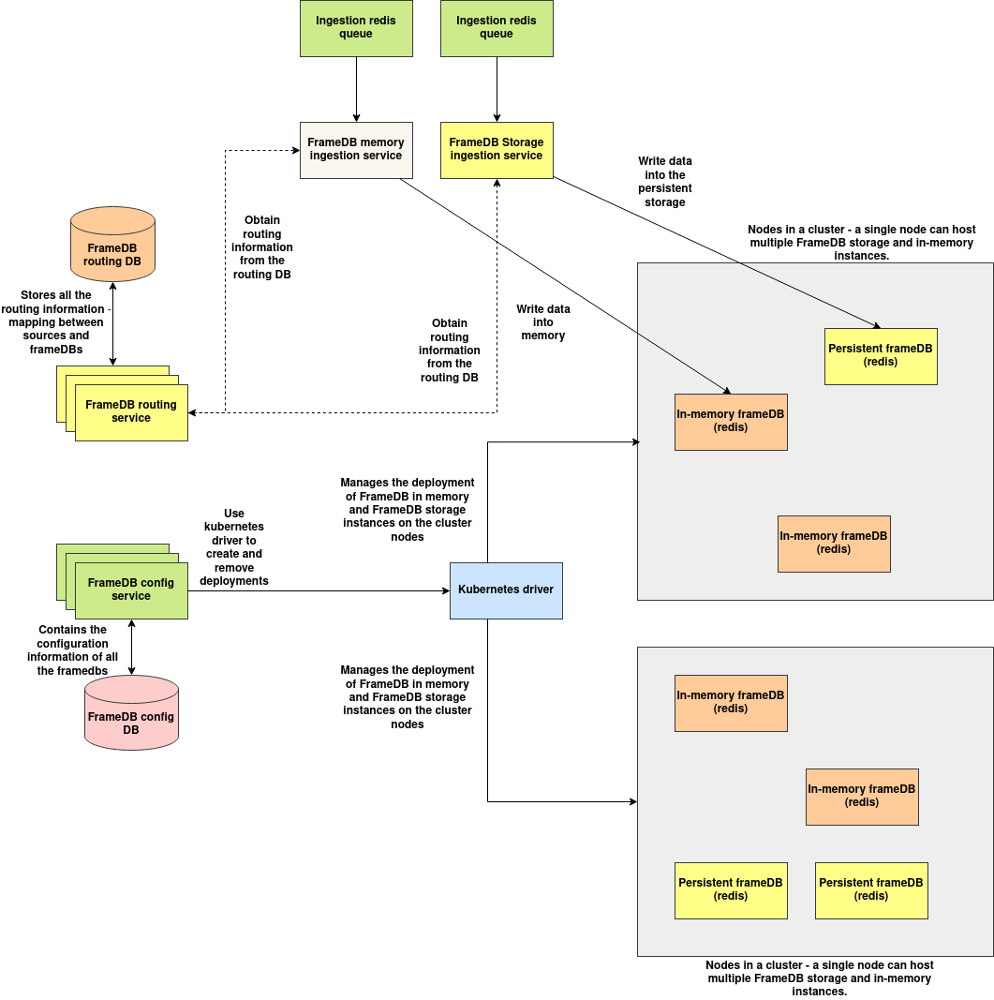

# FrameDB

**Note: This documentation is a work in progress.**

FrameDB is a distributed data store designed to store large files/binary data locally on a collection of nodes. It forms a core part of the architecture, enabling large data—such as videos, high-resolution images, or extensive text corpora—to be ingested into the local node's database. This data can later be retrieved by the processing instance as needed.

FrameDB supports in-memory as well as persistent storage.

For FrameDB in-memory operation - Redis is used internally and for persistent storage TiDB is used.

## Features:

1. A easy to use in-memory and persistent storage system powered by redis and TiDB.

2. APIs to create and manage instances of both persistent storage and in memory instances.

3. APIs to write and read data from any frame-db instance provided its ID irrespective of whether its in memory or storage.

---

## Architecture



### Components:

**1. FrameDB config service**: FrameDB config service is responsible for maintaining the configuration of FrameDB deployments and also provides necessary kubernetes integrations to deploy the FrameDB deployments on the target nodes of the cluster.

**2. Kubernetes drivers**: Kubernetes drivers provides necessary code to deploy FrameDB deployments on the target cluster, it is integrated with the FrameDB config service and acts on the commands of the FrameDB config service.

**3. FrameDB routing service**: FrameDB routing service contains the mapping of FrameDB ID, FrameDB storage instance's URL mapping, this mapping can be referenced by several services that integrates with FrameDB, provided the FrameDB IP the routing service provides the URL of the service within the cluster.

**4. FrameDB Ingestion services**: FrameDB ingestion services are responsible for ingesting data from outside and writing the contents to the target FrameDB instance. FrameDB ingestion services are available both for in-memory and persistent storage.

**5. FrameDB instances**: FrameDB instances are used to store the data written into the FrameDBs, services that reads the data from FrameDB are connected directly to these DBs for fast reading without a proxy by resolving the URL from the routing service. There are two types of FrameDB instances:

**a. FrameDB in-memory instances**: These are redis instances that store data in memory, backup is disabled by default which can be enabled if needed. The deployments of FrameDB in-memory instances can be deployed in replica mode with quorum configured to enable replication. A **FrameDB Cluster** is a collection of the master redis node, the redis sentinels and the replica worker nodes. It is possible to deploy any number of FrameDB clusters on a single kubernetes cluster node.

**b. FrameDB persistence instances**: Powered by TiDB, however there are plans to use a different DB in the future, when deploying TiDB instances, it is possible to configure storage size, replication and DB parameters. 

---

## FrameDB In-Memory DBD APIs:

> Documentation for APIs in FrameDB is a work in progress, comprehensive list of APIs will updated in this documentation incrementally.


### 1. API to Create a Cluster

**Description:**  
Creates a new cluster with the given name, node configuration, and replication settings.

**Endpoint:**  
`POST /cluster/createCluster`

**Curl Command:**  
```bash
curl -X POST http://<cluster-config-url>:5000/cluster/createCluster \
     -H "Content-Type: application/json" \
     -d '{
           "clusterName": "cluster-alpha",
           "nodeTag": "node-1",
           "replicas": 3,
           "enableMetrics": true,
           "quorum": 2
         }'
```

**Request Parameters:**

| Parameter       | Type    | Description                          |
|----------------|---------|--------------------------------------|
| clusterName     | string  | Unique name for the cluster          |
| nodeTag         | string  | Identifier for the node              |
| replicas        | integer | Number of replica nodes              |
| enableMetrics   | bool    | Enable or disable metrics collection |
| quorum          | integer | Quorum value for the cluster         |

---

### 2. API to Remove a Cluster

**Description:**  
Removes the specified cluster from FrameDB.

**Endpoint:**  
`POST /cluster/removeCluster`

**Curl Command:**  
```bash
curl -X POST http://<cluster-config-url>:5000/cluster/removeCluster \
     -H "Content-Type: application/json" \
     -d '{
           "clusterName": "cluster-alpha"
         }'
```

**Request Parameters:**

| Parameter   | Type   | Description              |
|------------|--------|--------------------------|
| clusterName | string | Name of the cluster to remove |

---

### 3. API to Get Cluster Info

**Description:**  
Retrieves metadata and configuration details of a specific cluster.

**Endpoint:**  
`POST /cluster/getClusterInfo`

**Curl Command:**  
```bash
curl -X POST http://<cluster-config-url>:5000/cluster/getClusterInfo \
     -H "Content-Type: application/json" \
     -d '{
           "clusterName": "cluster-alpha"
         }'
```

**Request Parameters:**

| Parameter   | Type   | Description               |
|------------|--------|---------------------------|
| clusterName | string | Name of the cluster to query |

---

### 4. API to Synchronize FrameDB with Deployment Info

**Description:**  
Fetches all FrameDB deployment synchronization data using a flag.

**Endpoint:**  
`POST /cluster/synchronize`

**Curl Command:**  
```bash
curl -X POST http://<cluster-config-url>:5000/cluster/synchronize \
     -H "Content-Type: application/json" \
     -d '{
           "synchronize": true
         }'
```

**Request Parameters:**

| Parameter   | Type   | Description                          |
|------------|--------|--------------------------------------|
| synchronize | bool   | Trigger synchronization check        |

---

### 5. API to Synchronize a Specific Cluster with FrameDB

**Description:**  
Synchronizes FrameDB with the state of the specified cluster.

**Endpoint:**  
`POST /cluster/synchronizeCluster`

**Curl Command:**  
```bash
curl -X POST http://<cluster-config-url>:5000/cluster/synchronizeCluster \
     -H "Content-Type: application/json" \
     -d '{
           "clusterName": "cluster-alpha"
         }'
```

**Request Parameters:**

| Parameter   | Type   | Description                     |
|------------|--------|---------------------------------|
| clusterName | string | Name of the cluster to sync     |

---

### 6. API to Create Multiple Clusters

**Description:**  
Creates multiple clusters with a common prefix and sequential numbering.

**Endpoint:**  
`POST /cluster/createClusters`

**Curl Command:**  
```bash
curl -X POST http://<cluster-config-url>:5000/cluster/createClusters \
     -H "Content-Type: application/json" \
     -d '{
           "clusterPrefix": "test-cluster",
           "startIndex": 1,
           "nClusters": 5,
           "nodeTag": "node-a",
           "replicas": 3,
           "enableMetrics": false,
           "quorum": 2
         }'
```

**Request Parameters:**

| Parameter      | Type    | Description                                        |
|----------------|---------|----------------------------------------------------|
| clusterPrefix  | string  | Prefix for naming the clusters                     |
| startIndex     | integer | Index to start numbering the clusters              |
| nClusters      | integer | Number of clusters to create                       |
| nodeTag        | string  | Node tag used across all created clusters          |
| replicas       | integer | Number of replicas for each cluster                |
| enableMetrics  | bool    | Enable metrics for all clusters                    |
| quorum         | integer | Quorum count for all clusters                      |

---

### 7. API to Remove Multiple Clusters

**Description:**  
Deletes multiple clusters in one call using a list of cluster names.

**Endpoint:**  
`POST /cluster/removeClusters`

**Curl Command:**  
```bash
curl -X POST http://<cluster-config-url>:5000/cluster/removeClusters \
     -H "Content-Type: application/json" \
     -d '{
           "clusterList": ["cluster-alpha", "cluster-beta", "cluster-gamma"]
         }'
```

**Request Parameters:**

| Parameter     | Type     | Description                        |
|---------------|----------|------------------------------------|
| clusterList   | string[] | List of cluster names to remove    |

---

### 8. API to Create Replication (Scale Replicas)

**Description:**  
Scales the number of replica nodes in an existing cluster by adjusting the replication factor.

**Endpoint:**  
`POST /replication/createReplication`

**Curl Command:**  
```bash
curl -X POST http://<cluster-config-url>:5000/replication/createReplication \
     -H "Content-Type: application/json" \
     -d '{
           "clusterId": "cluster-alpha",
           "replicas": 4
         }'
```

**Request Parameters:**

| Parameter   | Type    | Description                             |
|------------|---------|-----------------------------------------|
| clusterId  | string  | Identifier of the cluster to replicate   |
| replicas   | integer | Desired number of replicas               |

--- 

### 9. API to Get Master Node by FrameDB ID

**Description:**  
Discovers and returns the master node associated with the given `framedb_id`.

**Endpoint:**  
`POST /discovery/getMaster`

**Curl Command:**  
```bash
curl -X POST http://<server-url>:5000/discovery/getMaster \
     -H "Content-Type: application/json" \
     -d '{
           "framedb_id": "framedb-xyz"
         }'
```

**Request Parameters:**

| Parameter    | Type   | Description                       |
|--------------|--------|-----------------------------------|
| framedb_id   | string | Unique ID of the FrameDB instance |

---

### 10. API to Get Slave Nodes by FrameDB ID

**Description:**  
Discovers all slave nodes associated with the given `framedb_id`.

**Endpoint:**  
`POST /discovery/getSlaves`

**Curl Command:**  
```bash
curl -X POST http://<server-url>:5000/discovery/getSlaves \
     -H "Content-Type: application/json" \
     -d '{
           "framedb_id": "framedb-xyz"
         }'
```

**Request Parameters:**

| Parameter    | Type   | Description                       |
|--------------|--------|-----------------------------------|
| framedb_id   | string | Unique ID of the FrameDB instance |

---

### 11. API to Get Cluster Info by FrameDB ID

**Description:**  
Retrieves cluster metadata associated with a specific `framedb_id`.

**Endpoint:**  
`POST /discovery/getClusterInfo`

**Curl Command:**  
```bash
curl -X POST http://<server-url>:5000/discovery/getClusterInfo \
     -H "Content-Type: application/json" \
     -d '{
           "framedb_id": "framedb-xyz"
         }'
```

**Request Parameters:**

| Parameter    | Type   | Description                       |
|--------------|--------|-----------------------------------|
| framedb_id   | string | Unique ID of the FrameDB instance |

---

### 12. API to Get Master Node by Cluster Name

**Description:**  
Discovers the master node of the cluster identified by its `clusterName`.

**Endpoint:**  
`POST /discovery/getClusterMaster`

**Curl Command:**  
```bash
curl -X POST http://<server-url>:5000/discovery/getClusterMaster \
     -H "Content-Type: application/json" \
     -d '{
           "clusterName": "cluster-alpha"
         }'
```

**Request Parameters:**

| Parameter    | Type   | Description                |
|--------------|--------|----------------------------|
| clusterName  | string | Name of the cluster        |

---

## FrameDB routing service APIs:

> Documentation for APIs in FrameDB is a work in progress, comprehensive list of APIs will updated in this documentation incrementally.


### 1. API to Get Routing Mappings by Source ID

**Description:**  
Fetches the routing mappings associated with a given `sourceId`. Typically used to retrieve how data from a source is being routed or mapped in the system.

**Endpoint:**  
`POST /routing/getMapping`

**Curl Command:**  
```bash
curl -X POST http://<server-url>:5000/routing/getMapping \
     -H "Content-Type: application/json" \
     -d '{
           "sourceId": "source-123"
         }'
```

**Request Parameters:**

| Parameter  | Type   | Description                           |
|------------|--------|---------------------------------------|
| sourceId   | string | Unique identifier for the data source |

---

### 2. API to Get Master Node by FrameDB ID

**Description:**  
Discovers and returns the master node associated with the given `framedb_id`.

**Endpoint:**  
`POST /discovery/getMaster`

**Curl Command:**  
```bash
curl -X POST http://<server-url>:5000/discovery/getMaster \
     -H "Content-Type: application/json" \
     -d '{
           "framedb_id": "framedb-xyz"
         }'
```

**Request Parameters:**

| Parameter    | Type   | Description                       |
|--------------|--------|-----------------------------------|
| framedb_id   | string | Unique ID of the FrameDB instance |

---

Here's the structured technical documentation for the **`FrameDB`** class, excluding the `decr_ref` method:

---

## FrameDB Class Documentation

The `FrameDB` class provides high-level utilities to interact with a distributed Redis-based datastore. It supports dynamic connection management, synchronous/asynchronous frame retrieval, and frame deletion reference handling.

---

### **Constructor**

```python
FrameDB(svc_params, env, logger)
```

**Parameters:**

| Parameter   | Type         | Description                              |
|-------------|--------------|------------------------------------------|
| svc_params  | `dict`       | Service parameters (usage internal)      |
| env         | `object`     | Environment configuration object         |
| logger      | `AIOSLogger` | Custom logger for internal error logging |

---

### **1. set_required_sizes**

```python
set_required_sizes(sizes: list)
```

Sets the frame sizes that the application expects to handle.

| Parameter | Type  | Description                 |
|-----------|-------|-----------------------------|
| sizes     | list  | List of sizes to track/use  |

---

### **2. get_frames_from**

```python
get_frames_from(sourceID: str, keys_suffixed: list) -> Tuple[bool, Any]
```

Synchronously fetches frame data for given keys.

| Parameter      | Type     | Description                          |
|----------------|----------|--------------------------------------|
| sourceID       | str      | Source identifier                    |
| keys_suffixed  | list     | List of Redis keys to fetch          |

**Returns:**  
Tuple of `(success: bool, data: list | error: str)`

---

### **3. get_frames_async**

```python
get_frames_async(sourceID: str, keys_suffixed: list, k: dict, cb: callable) -> Tuple[bool, str]
```

Asynchronously fetches frames using a background thread and invokes the callback on completion.

| Parameter      | Type     | Description                              |
|----------------|----------|------------------------------------------|
| sourceID       | str      | Source identifier                        |
| keys_suffixed  | list     | List of Redis keys to fetch              |
| k              | dict     | Extra arguments passed to the callback   |
| cb             | callable | Callback function to handle the result   |

**Returns:**  
Tuple of `(success: bool, message: str)`

---

### **4. register_frames_channel**

```python
register_frames_channel(sourceID: str, cb: callable) -> Tuple[bool, str]
```

Registers a source with the internal fetch and callback queues and starts the async thread.

| Parameter | Type     | Description                        |
|-----------|----------|------------------------------------|
| sourceID  | str      | Source identifier                  |
| cb        | callable | Callback function for fetched data |

**Returns:**  
Tuple of `(success: bool, message: str)`

---

### **5. register_frame_delete_channel**

```python
register_frame_delete_channel(sourceID: str) -> Tuple[bool, str]
```

Initializes a queue for handling batch deletion of keys after dereferencing. Does not start a thread (excluded as per request).

| Parameter | Type | Description         |
|-----------|------|---------------------|
| sourceID  | str  | Source identifier   |

**Returns:**  
Tuple of `(success: bool, message: str)`

---

### **6. push_sync**

```python
push_sync(connection, outputs: dict) -> Tuple[bool, str]
```

Pushes frame outputs into Redis in a pipelined manner. Uses an optional output serializer if set.

| Parameter  | Type       | Description                             |
|------------|------------|-----------------------------------------|
| connection | RedisConn  | Active Redis connection instance        |
| outputs    | dict       | Dictionary of key-value frame data      |

**Returns:**  
Tuple of `(success: bool, message: str)`

---

### **7. decr_batch_keys**

```python
decr_batch_keys(sourceID: str, keys: dict)
```

Schedules a batch of keys to be dereferenced and potentially deleted based on ref counts.

| Parameter | Type | Description                                       |
|-----------|------|---------------------------------------------------|
| sourceID  | str  | Source identifier                                 |
| keys      | dict | Dictionary mapping keys to (decr_by, sizes_list)  |

---

### **8. set_output_serializer**

```python
set_output_serializer(cb: callable)
```

Sets a callback that transforms or serializes output before pushing to Redis.

| Parameter | Type     | Description                            |
|-----------|----------|----------------------------------------|
| cb        | callable | Serializer function returning (bool, result) |

---

## Usage examples:

### Setup (Prerequisite)

> Documentation for APIs in FrameDB is a work in progress, comprehensive list of APIs will updated in this documentation incrementally.

```python
from framedb_api.framedb import FrameDB
from framedb_api.aios_logger import AIOSLogger
from framedb_api.env import Env  # Assume Env is your environment class

# Initialize environment and logger
env = Env()  # You must configure this class according to your system
logger = AIOSLogger()

# Initialize FrameDB
framedb = FrameDB(svc_params={}, env=env, logger=logger)
```

---

### Sync Read Example (`get_frames_from`)

```python
source_id = "camera-001"
keys_to_fetch = ["frame:cam001:00001", "frame:cam001:00002"]

success, data_or_error = framedb.get_frames_from(source_id, keys_to_fetch)

if success:
    print("Frames:", data_or_error)
else:
    print("Error:", data_or_error)
```

---

### Sync Write Example (`push_sync`)

```python
# Assume you already have a connection
success, connection = framedb._FrameDB__handle_new_connection("camera-001")
if not success:
    raise Exception("Redis connection failed")

outputs = {
    "frame:cam001:00003": b"<binary-data-1>",
    "frame:cam001:00004": b"<binary-data-2>"
}

framedb.push_sync(connection, outputs)
```

---

### Async Read Example (`get_frames_async`)

```python
def handle_frame_data(is_not_error, frame_data, frame_keys, **kwargs):
    if is_not_error:
        print(f"Received frames {frame_keys}:")
        for d in frame_data:
            print(d)
    else:
        print("Error occurred")

source_id = "camera-001"
keys_to_fetch = ["frame:cam001:00005", "frame:cam001:00006"]
metadata = {"job_id": "job-123"}

# Register async channel
framedb.register_frames_channel(source_id, handle_frame_data)

# Submit fetch request
framedb.get_frames_async(source_id, keys_to_fetch, metadata, handle_frame_data)
```

Note: The async reader uses background threads with queues. Ensure your main thread remains active (e.g., using `time.sleep()` or within an application lifecycle).

---

### Set Output Serializer (Optional)

```python
def serialize_frames(outputs):
    # Convert all frames to compressed JSON (example)
    try:
        result = {k: json.dumps(v.decode()).encode() for k, v in outputs.items()}
        return True, result
    except Exception:
        return False, {}

framedb.set_output_serializer(serialize_frames)
```
