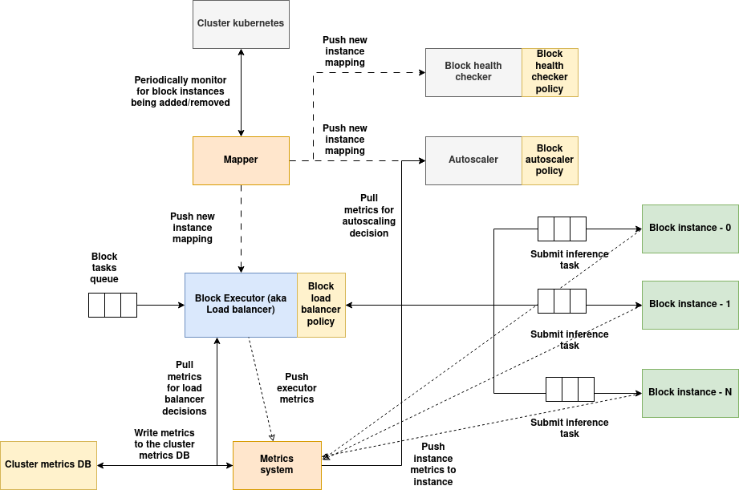
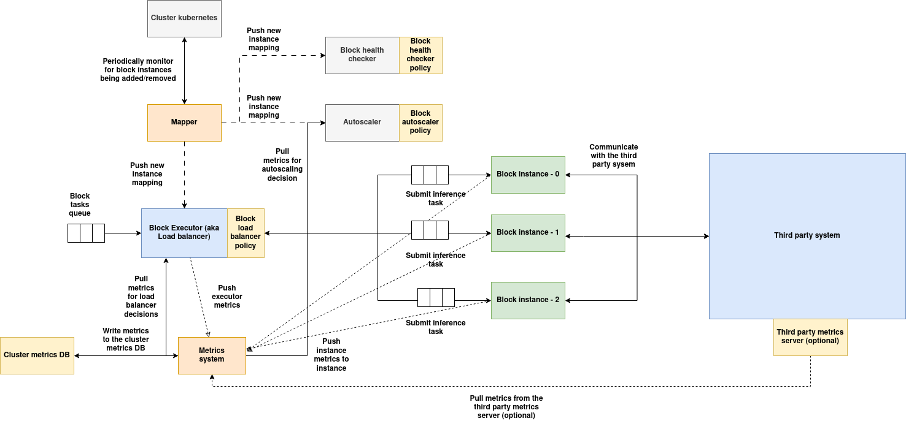

# Concepts:

## Network

A network in AIOS, also called a "Grid", is a collection of clusters governed by a single management cluster. In a network, the management cluster is the governing body and can impose its own rules that determine what type of clusters can be onboarded to the network, what type of nodes can be added to the clusters that are part of the network, what type of management commands can be executed on the clusters and blocks, and what type of blocks (workloads) can be scheduled.

To set up a network, one must first set up a management cluster. The instructions to set up the management cluster can be [found here](../installation/installation.md).

A network can theoretically accommodate an infinite number of clusters unless a limit is imposed by the governing policy that controls cluster onboarding.

The governing policies are added as pre-check policies for the Cluster Controller Gateway APIs. These pre-check policies are executed on the corresponding API calls using the payload passed to them. These policies can choose to allow or disallow specific actions based on predefined conditions, and they can also modify the input payload.

### Services of the management cluster:

**1. Parser:** The Parser service acts as a gateway to create blocks, vDAGs, registry components, and clusters by submitting a specification JSON document. It applies a default standard specification but also allows users to define their own using templates from the registry and the policy system. [Refer to this documentation for more details](../parser/parser.md)

**2. Cluster Controller Gateway:** The Cluster Controller Gateway manages clusters within a network. It initializes cluster infrastructure, schedules blocks (in coordination with the target cluster's controller), and acts as a proxy to execute management commands for blocks and clusters. It also handles configuration tweaks for policies, vDAG controller infrastructure setup, and pre-check policy implementations. [Refer to this documentation for more details](../cluster-controller-gateway/cluster-cotroller-gateway.md)

**3. Resource Allocator:** The Resource Allocator executes resource allocation policies. The Cluster Controller Gateway uses it to determine the appropriate cluster, node, and GPUs for block scheduling. Users can also perform manual dry-runs to identify the optimal deployment targets. [Refer to this documentation for more details](../resource_allocator/resource-allocator.md)

**4. Policies System:** The Policies System includes a database, registry service, executors, and Kubernetes interfaces. It allows storing, loading, querying, and executing policies, or deploying them as jobs or remote functions. [Refer to this documentation for more details](../policies-system/policies-system.md)

**5. Registries:** The management cluster hosts multiple registries that are responsible for storing information related to multiple functionalities. [Refer to this documentation for more details](../db-registries/runtime-db-registries.md)

---

## Cluster

A `Cluster` in AIOS is a Kubernetes cluster that holds one or more nodes. Clusters can be added to or removed from the network, and a cluster cannot be part of multiple networks. A cluster can be a data-center computing cluster, a local homegrown cluster of machines, or a Kubernetes cluster deployed on clouds like AWS or GCP.

To join a cluster to the network, [refer to this detailed documentation page](../onboarding-notes/onboarding-cluster.md).

When a cluster joins a network, the control and metrics services needed for the operation of the cluster are deployed automatically by the Cluster Controller Gateway. These services include:

1. **Cluster controller**: The Cluster Controller is responsible for managing the cluster. Just like the network, the Cluster Controller Gateway implements governing policies that determine what type of nodes can be onboarded, what type of blocks can be scheduled, and what type of management commands can be executed on the cluster services and the blocks. [Refer to this documentation for more details](../cluster-controller/cluster-controller.md)

2. **Local Metrics collector database**: The Local Metrics Collector Database is used for storing and indexing metrics local to the cluster. These metrics include those collected from blocks and node hardware components. These metrics can be pulled by various cluster and block policies to make decisions. [Refer to this documentation for more details](../metrics-system/metrics-system.md#local-metrics-database)

3. **Optional components**: A cluster can also deploy optional components like a container registry, assets registry, policy executor system, and ad-hoc inference server, and list the entries in the decentralized registry to make them usable by users. To learn more about how to deploy these optional components, [refer to this documentation](../onboarding-notes/onboarding-cluster.md#deploying-add-on-services).

---

## Node

A Node is the basic unit of computation that can be joined to a cluster. Any user who has spare compute can join any of the available clusters to contribute to the pool of resources. A node can be any heterogeneous computing resource — it can be a NUC, a node in a data-center rack, or a VM deployed on a cloud. A node can optionally include multiple GPUs. To onboard a node, [refer to the following document](../onboarding-notes/onboarding-node.md).

Instances of compute are deployed on the nodes. A node can have multiple instances of the same block or instances from different blocks. The GPUs in the node can be shared by multiple instances.

A node also runs a metrics collector DaemonSet, which runs on all nodes of the cluster by default. This service runs in host mode and periodically taps into all available system resources, including GPUs, and reports the metrics to the cluster's metrics collector. [Refer to the metrics documentation to understand more about the node metrics DaemonSet](../metrics-system/metrics-system.md#node-metrics-daemonsets)

---

## Policies

A policy is a dynamically loadable, executable Python code that is used in various places and use cases across the AIOS system. Since policies are dynamic, they allow developers to implement custom functionalities throughout the AIOS system.

Policies are used in many components and for various purposes. Overall, they enable developers to implement custom functionality on top of the existing system wherever customization is supported. This flexibility makes AIOS a general-purpose platform that does not impose rigid constraints, empowering developers to make decisions as needed.

Policies can be executed in five different ways across the AIOS system:

### 1. Type 1: Policy loaded and executed as part of another AIOS application inside its own process space

Any service that implements and uses the Local Policy Evaluation SDK can download the policy code and execute it locally to extend its own functionality. These policies can be stateful or stateless depending on how the application uses them. Refer to the Local Policy Evaluation Guide to understand how to load and execute a policy locally within the application space.

**Characteristics**:

1. **Policy Lifecycle**: Completely dependent on the application. The application can load and terminate the policy at any time.
2. **Communication**: Communication between the policy and the application happens through in-process memory.
3. **Scaling**: Scaling is not handled implicitly. The application decides when to create another process/thread as per its own requirements.
4. **Fault Tolerance**: Depends on the fault tolerance of the application.

### 2. Type 2: Policies executed by the central policy executor

Applications can tap into the online policy executors to execute policies and fetch results using the **Policy System APIs**. In this case, the policy is executed by the policy executor with its own memory and resources, which the application does not need to provide. Developers can also deploy their own policy executor on a remote machine and use it with their application (refer to the Policy System Guide for more details).

**Important**: Type 2 policy execution mode can only be used for stateless policies. Refer to Type 4 for stateful remote policy deployments.

**Characteristics**:

1. **Policy Lifecycle**: Stateless. The policy is loaded into the executor's memory and evicted once execution is complete.
2. **Communication**: Communication between the policy and the application happens through a REST API over HTTP. Execution is handled by the executor.
3. **Scaling**: Not handled implicitly. The executor can scale its instances based on load.
4. **Fault Tolerance**: Depends on the fault tolerance of the executor.

### 3. Type 3: Policies deployed on remote clusters as jobs

Policies can be deployed as jobs on a remote cluster that has a registered policy executor. This type is useful for scenarios where you want to run a resource-heavy policy one-time on a remote node, without persistence. It can also be used to gather data about the remote cluster—such as metrics, available resources, or node health.

**Important**: Type 3 policy execution is stateless; its lifecycle begins and ends as a one-time job.

**Characteristics**:

1. **Policy Lifecycle**: Stateless. The policy runs as a Kubernetes Job and is terminated by Kubernetes upon completion.
2. **Communication**: The application cannot communicate with the policy during execution—it can only wait for the results.
3. **Scaling**: Not applicable.
4. **Fault Tolerance**: Handled by Kubernetes.

### 4. Type 4: Policies deployed as stateful online functions

Policies can be deployed as stateful functions that expose their services via the Policy System Service (refer to the Policy System section below). These functions can be invoked via REST API.

**Characteristics**:

1. **Policy Lifecycle**: Stateful. Initialized once after function deployment and runs as a pod on Kubernetes.
2. **Communication**: Communication between the policy and the application happens through a REST API over HTTP.
3. **Scaling**: Autoscaling rules can be set at the time of function creation.
4. **Fault Tolerance**: Handled by Kubernetes.

### 5. Type 5: Policies as a graph

Static DAGs (Directed Acyclic Graphs) can be defined over policies deployed as Type 4 functions. Each node in the DAG is a policy function. These graphs are pre-defined, stored in a registry, and can be searched and executed using a graph ID.

**Characteristics**:

1. **Policy Lifecycle**: Nodes in the graph are stateful and inherit the same properties as Type 4 policies.
2. **Communication**: Communication between graph nodes is orchestrated by the Policy System (refer to Policy System APIs).
3. **Scaling**: Nodes can be individually scaled, as each one is a Type 4 policy function.
4. **Fault Tolerance**: Handled by Kubernetes.

Here's a table summarizing the five types of policy execution across the AIOS system:

| **Type** | **Description** | **Policy Lifecycle** | **Communication** | **Scaling** | **Fault Tolerance** |
|---------|------------------|----------------------|-------------------|--------------|----------------------|
| **Type 1** Policy loaded and executed inside an AIOS application | Executed within the application's own process using the Local Policy Evaluation SDK | Managed by the application; can be loaded/unloaded anytime | In-process memory | Handled by the application (manual process/thread management) | Depends on the application |
| **Type 2** Policy executed by the central policy executor | Stateless policies executed via centralized policy executors using Policy System APIs | Stateless; loaded into memory and evicted after execution | REST API over HTTP | Executors can scale based on load (not implicit) | Depends on the executor |
| **Type 3** Policy deployed as a job on remote clusters | One-time stateless policy execution on a remote Kubernetes cluster | Stateless; runs as a Kubernetes Job and terminates upon completion | No live communication; application waits for results | Not applicable | Handled by Kubernetes |
| **Type 4** Policy deployed as a stateful online function | Stateful policies running as long-lived Kubernetes pods, exposed via REST API | Stateful; initialized once and runs as a pod | REST API over HTTP | Autoscaling rules configurable at deployment | Handled by Kubernetes |
| **Type 5** Policies as a graph (DAG) of Type 4 functions | DAG of stateful Type 4 policies orchestrated by the policy system | Stateful; each node inherits Type 4 lifecycle | Orchestrated by the Policy System | Each node can scale independently | Handled by Kubernetes |

---

## Component

Component is a specification that contains the information of the container image built using AIOS instance SDK together additional info and metadata that can be used to instantiate a block. 

Developers who build their computational instances (like model servers, ML applications etc) using AIOS instance SDK need to provide a component specification as a supporting component to make it instantiable as a block, here is the basic workflow:

1. Developer writes a model server or any application in general using AIOS instance SDK.

2. Builds the instance image using `aios_instance:v1` as the base container image.

3. Uploads the image to any of the available registries, can be self hosted, external registry or any of the registries provided by AIOS network.

4. Writes a component specification to include metadata, additional information for the container image.

**The component specification includes the following information:**

1. Component name and version information using which a unique `componentURI` is generated, this component URI can be used in block specification while creating a block.

2. Metadata object which describes the meta information like author name, author contact information etc.

3. Container image information of the main instance code, side-cars and init containers.

4. Default settings and parameters objects to define default settings and parameters.

5. Protocol specification for input, output, settings, parameters and management commands that define the template structure.

Components are stored in the components registry which provides interface to search components. 

For more information about the specification of components, [refer to the following documentation](../parser/component.md).

For more information about the components registry, [refer to the following documentation](../db-registries/component-registry.md).

---

## Block

Block the core component AIOSv1 responsible for instantiating, serving, scaling and managing the AI inference or any general computational workload defined using AIOSv1 Instance SDK provided as a component. A block can be scheduled on any cluster within the network of clusters that satisfies the resource requirements. A block can spawn across multiple nodes in the cluster, but it cannot be deployed across multiple clusters. 

### Functionalities of a block:
1. Manages one or more instances of the AI or general computational workload. 
2. Spins up a load balancer (known as executor) which can be used for load balancing the tasks among the instances, the load balancing logic can be defined by the developer using load balancing policy.
3. Spins up Auto-scaler module as a side-car, this module monitors the instances and takes scaling decisions using Auto-scaling policy defined by the developer.
4. Provides APIs for executing management commands to update the configuration, query data from the auto-scaling and load balancing policies.
5. Provides APIs for fetching the metrics of instances and executor (load balancer)
6. Provides a health checker module as a side-car which is used to check the health of the instances and execute the developer defined health checker policy to check if the instances are healthy.
7. Provides a gRPC proxy server which will be used for exposing the block inference API to the outside world via the ingress.

### Architecture:

([Download the architecture diagram](../assets/block-arch.png))

**Services of block**:

1. **Executor**: Executor acts as a gateway for the block, tasks submitted to the block are load balanced using a load balancer policy, also implements executor metrics. Executors can't talk directly to the third party system, instead component instances are used as proxy.

2. **Mapper service**: Mapper service monitors for instance additions and removals periodically, when instances are added/removed, the new list of instances will be populated and sent to all the block's services, so they can maintain the updated state of instances.

3. **Auto-scaler**: Auto-scaler periodically monitors the metrics of all the instances, executes auto-scaler policy to determine if the instances needs to be scaled/down-scaled based on the workload demand. In case of third party system, auto-scaler can only scale the instances of the block but not the third party system, the third party system should take care of scaling on its own if its supported.

4. **Health checker**: This service periodically calls the health endpoint of all the instances of the block, runs health checker policy to determine if all the instances are healthy and takes the necessary action (defined in the policy) if anomalies are detected. In case of third party system, the instances must respond to the health check response on behalf of the third party system.

5. **Metrics system**: Metrics system is spread across the executor and instances, metrics system consumes the metrics and actively writes it to the local cluster metrics DB and the global metrics DBs.

6. **Instances**: The container image built using AIOS instance SDK will be instantiated as an instance of the block, in case the block is linked to a third party system, the instance should implement necessary code to interact with the third party system, i.e the instance must act as an abstraction between the executor and the third party system, when a task is submitted to the instance, instance converts the task data into a format suitable for third party system, communicates with the third party system, obtains the result, converts the result into task response accepted by AIOS system. Instance also calls the pre and post processing policy if the task is from a vDAG, it also pushes the output data to one or more side-cars if defined.

---

## vDAG

A vDAG, or **virtual Directed Acyclic Graph**, is a DAG workflow defined over a set of running blocks across the network. Each node of a vDAG can be a block or another existing vDAG, enabling the creation of nested graphs.

The nodes in a vDAG can be fixed to a pre-determined block, or an assignment policy can be provided that performs a search over the list of available blocks to determine the appropriate one for the required purpose.

Using the concept of vDAGs, it is possible to create composite workflows of AI and non-AI blocks arranged in a specific sequence, enabling the development of end-to-end applications that run entirely as blocks on a distributed network of clusters, with each block scaled according to demand.

Multiple vDAG nodes can be assigned to a block, thus a block can serve in multiple vDAG flows and at the same time process adhoc-inference requests.

**Features of vDAG**:

1. Support for sub-graphs where each node in the vDAG references another existing vDAG.

2. A graph can span blocks present within the same cluster or across multiple clusters in the network.

3. Ability to search and select the appropriate block for a node in the vDAG using an assignment policy during vDAG creation.

4. Conditional routing among several available paths in the vDAG, which can be implemented using the post-processing policy.

5. Custom pre- and post-processing policies for each node in the vDAG. These policies are executed by the AIOS instance SDK of the corresponding block before and after inference. They can be used to implement custom input/output transformations.

6. Support for various workflow structures such as multiple producers–single consumer and single producer–multiple consumers, which is useful for implementing logic like multiplexing, ensembles, branch-out, etc.

To make the vDAG available for serving, the developer needs to deploy the vDAG controller, which acts as a gateway for users to submit vDAG inference tasks. The vDAG controller also provides several additional functionalities.

**Functionalities of vDAG controller**:

1. Provides a gateway through which tasks can be submitted to a vDAG. These tasks are executed and the results are returned by the vDAG controller.

2. Provides a mechanism for the vDAG provider to implement quotas and rate-limiting policies — allowing limitation of tasks per session ID or globally.

3. Provides a mechanism to implement a health checker policy, which periodically monitors the health of the blocks involved across the network.

4. Provides a mechanism for periodic quality checks using a quality checker policy. This policy periodically validates the final output of a vDAG against its input, and can submit this payload to an external QA system or for manual audit.

5. Provides APIs to execute management commands related to quota management, health checking, and quality checking policies.

6. Implements metrics that can be used to monitor the performance of the vDAG — such as latency, throughput, etc.

---

## Master DAG:

Master DAG is a logical DAG formed by superimposition of all the vDAGs currently running in the system across all the available blocks at any given point in time. 

---

## Third party system

Third-party systems can be integrated as part of an AIOS Block. In a typical block lifecycle, a component container image—built using the AIOS Instance SDK—is onboarded into the component registry and then instantiated as a block. This block includes management services such as the executor, autoscaler, and metrics system, and it spins up the component containers as pods known as "instances." These instances can scale based on demand.

However, in the case of a third-party instance block, an external stand-alone system is deployed alongside the block's management services and instances. This third-party system, such as an inference server, can run across multiple nodes within the same cluster. It manages its own lifecycle independently. The block will redirect the tasks assigned to it to this external service, the instances of the block takes care of converting the AIOS task input to the external system specific input and vice versa in case of output.

Using this approach, an AIOS block can be linked with an external third-party system that performs the actual computation.

### When Are Third-Party Instances Useful?

1. When the application logic is too complex to be efficiently implemented as an AIOS instance.

2. When your application needs to run across multiple nodes in the cluster, whereas an AIOS instance is limited to a single node.

3. When the application consists of a complex set of distributed services that manage their own scaling, lifecycle, and orchestration, which differ significantly from how AIOS operates.

### Architecture:

([Download the architecture diagram](../assets/third-party-block.png))

**Services of block**:

1. **Executor**: Executor acts as a gateway for the block, tasks submitted to the block are load balanced using a load balancer policy, also implements executor metrics. Executors can't talk directly to the third party system, instead component instances are used as proxy.

2. **Mapper service**: Mapper service monitors for instance additions and removals periodically, when instances are added/removed, the new list of instances will be populated and sent to all the block's services, so they can maintain the updated state of instances.

3. **Auto-scaler**: Auto-scaler periodically monitors the metrics of all the instances, executes auto-scaler policy to determine if the instances needs to be scaled/down-scaled based on the workload demand. In case of third party system, auto-scaler can only scale the instances of the block but not the third party system, the third party system should take care of scaling on its own if its supported.

4. **Health checker**: This service periodically calls the health endpoint of all the instances of the block, runs health checker policy to determine if all the instances are healthy and takes the necessary action (defined in the policy) if anomalies are detected. In case of third party system, the instances must respond to the health check response on behalf of the third party system.

5. **Metrics system**: Metrics system is spread across the executor and instances, metrics system consumes the metrics and actively writes it to the local cluster metrics DB and the global metrics DBs. 

**Instances and third party external system**:

1. **Instances**: The container image built using AIOS instance SDK will be instantiated as an instance of the block, in case the block is linked to a third party system, the instance should implement necessary code to interact with the third party system, i.e the instance must act as an abstraction between the executor and the third party system, when a task is submitted to the instance, instance converts the task data into a format suitable for third party system, communicates with the third party system, obtains the result, converts the result into task response accepted by AIOS system. Instance also calls the pre and post processing policy if the task is from a vDAG, it also pushes the output data to one or more side-cars if defined.

2. **Third party system**: Third part system is deployed as an extension to the block which acts as the processing unit, this third party system can be deployed outside of the cluster anywhere on the internet or on the same cluster, in either cases, it serves the task requests submitted by the instances. Third party systems can use GPUs as well and must take care of their own resource allocation.
Third party system can expose an optional metrics endpoint if the metrics are supported, these metrics are consumed by the metrics collector which will help auto-scaler and load-balancer make even more informed decisions.

### Deploying a Third-Party System Alongside a Block

Third-party services can be integrated with an AIOS block in two ways:

1. **Externally Managed**:  
   In this approach, the third-party system is deployed separately by the developer—either within the same cluster or on an external environment. The internal or public URL of this system is passed as a parameter to the block instance. The block instance then implements the logic to interact with this external system, effectively acting as a proxy.

2. **Managed by AIOS**:  
   In this setup, AIOS takes responsibility for deploying and managing the third-party system. When the block is created, an **init container** (provided by the developer) runs as a pod to set up the third-party infrastructure. During block removal, the same init container is triggered to uninstall the system. This third-party system runs on the same cluster as the block and cannot be deployed externally. As in the first case, the block instance acts as a proxy to interact with the system.

### Comparison Table

| Feature                         | Externally Managed                       | Managed by AIOS                              |
|-------------------------------|------------------------------------------|----------------------------------------------|
| **Deployment Responsibility** | Developer                                | AIOS (via developer-provided init container) |
| **Location**                  | Anywhere (same cluster or external)       | Same cluster as the block                    |
| **Lifecycle Management**      | Handled by the developer                 | Fully managed by AIOS                        |
| **Instance Role**             | Acts as a proxy to external system       | Acts as a proxy to locally deployed system   |
| **Flexibility**               | High (can connect to any endpoint)       | Limited to same cluster deployment           |
| **Setup Complexity**          | Developer-defined external setup         | Requires a correctly configured init container |