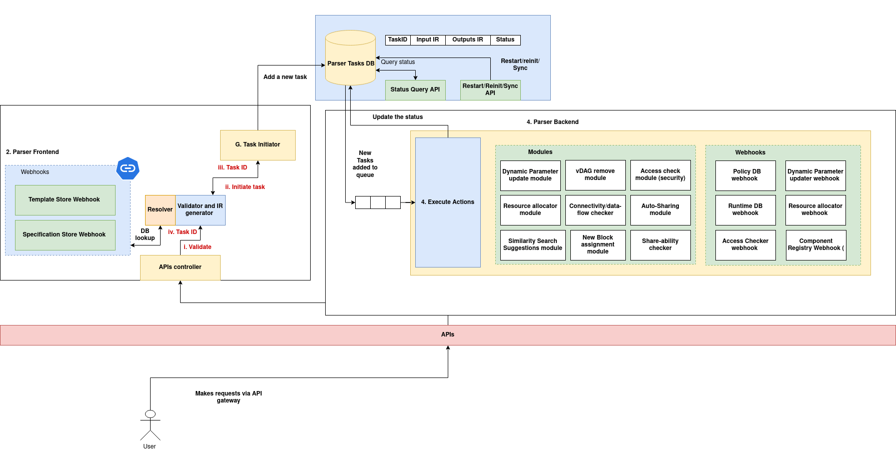

# Parser

**Parser** is a gateway microservice that serves as the entry point for external users and systems to interact with the Cluster Controller Gateway. It facilitates the execution of parser tasks such as cluster onboarding, node registration, component registration, block creation, and vDAG (virtual Directed Acyclic Graph) instantiation.

## Core Functionalities:

1. **API Interface**: Exposes RESTful APIs for submitting specifications to perform operations like cluster creation, node addition, component registration, block deployment, and vDAG creation.

2. **Template-Driven Specification Parsing**: Supports a default schema for defining cluster, node, component, block, and vDAG specifications. Developers can override this schema by using custom templates. These templates can be linked with validation and transformation policies (policy code), enabling custom specification formats and dynamic parsing behavior. These templates can also be used for validating the 

3. **Integration with Spec Store**: Interfaces with the Specification Registry (Spec Store), allowing users to reuse pre-defined specifications without modification. These saved specs can be directly used to provision clusters, components, blocks, and vDAGs.

4. **Search Server Implementation**: Embeds a unified search engine that enables querying across clusters, nodes, components, blocks, and vDAGs using a consistent query syntax. This enables efficient discovery and management of distributed resources.

5. **Parser Tasks Database**: Maintains a persistent log of all parsing tasks in the Parser Tasks DB. This enables auditing, tracking task execution history, and supports task re-execution for reproducibility and recovery.

6. **Backend Integration for Task Execution**: Integrates with backend components such as the Cluster Controller Gateway, vDAG Processing System, and Resource Allocator to orchestrate the creation and deployment of clusters, blocks, and vDAGs.

---

## Architecture



---

## Specification APIs:

Parser provides only two APIs, one for submitting the spec and another for using the already available spec from the spec store.

### Parser APIs:
Parser module provides the following APIs:

**Endpoint:** `/api/<action>`  
**Method:** `POST`  
**Description:**  

Accepts a JSON specification in the request body to execute a parser action such as creating a cluster, registering a node, deploying a block, or instantiating a vDAG. Optionally creates a task entry in the task database before invoking the parser engine.

**Example curl Command:**

```bash
curl -X POST http://<server-url>/api/create_cluster \
  -H "Content-Type: application/json" \
  -d @cluster_spec.json
```

---

**Endpoint:** `/api/with-spec/<action>?specUri=<uri>`  
**Method:** `POST`  
**Description:**  

Fetches the specification from the Spec Store using the provided `specUri` query parameter and executes the specified parser action. Optionally creates a task entry in the task database before invoking the parser engine.

**Example curl Command:**

```bash
curl -X POST "http://<server-url>/api/with-spec/create_cluster?specUri=specs/cluster/cluster1"
```

#### Here is the list of supported actions:

| **Action**             | **Description**                                                                 |
|------------------------|---------------------------------------------------------------------------------|
| `createBlock`          | Creates a new block in the system using the provided specification.             |
| `createCluster`        | Provisions and registers a new cluster using the given cluster specification.   |
| `createvDAG`           | Instantiates a new virtual Directed Acyclic Graph (vDAG) from the input spec.   |
| `search`               | Performs a similarity-based search across existing entities using given input.  |
| `filter`               | Filters existing resources based on conditions defined in the input spec.       |
| `addNode`              | Adds and registers a new node to an existing cluster.                           |
| `executeMgmtCommand`   | Executes management-level commands on clusters or blocks.               |

## Structure of Spec (specification):

Parser expects input specifications (specs) in a structured JSON format. This format is designed to support both internal and external templates, and consists of two main top-level fields: `header` and `body`.

#### 1. **Top-Level Fields**

| Field    | Type   | Required | Description                                                                 |
|----------|--------|----------|-----------------------------------------------------------------------------|
| `header` | Object | Yes      | Contains metadata about the spec, including the template to use and parameters. |
| `body`   | Object | Yes      | Contains the actual specification content or payload for the requested action.  |

---

#### 2. **`header` Object**

| Field          | Type   | Required | Description                                                                 |
|----------------|--------|----------|-----------------------------------------------------------------------------|
| `templateUri`  | String | Yes      | Identifies the template to be used for processing the spec. If set to `"Parser/V1"`, it is treated as an internal spec; any other value triggers external template execution. |
| `parameters`   | Object | No       | Additional parameters to pass to the template policy during processing.     |

---

#### 3. **`body` Object**

The structure of the `body` depends on the specific action being performed. For management commands (based on `mgmt_function_IR`), the expected internal structure is:

```json
"body": {
  "spec": {
    "values": {
      "blockId": "<string>",       // Required: ID of the block on which the command is executed
      "service": "<string>",       // Required: Target service within the block
      "mgmtCommand": "<string>",   // Required: Command to execute (e.g., restart, update)
      "mgmtData": { ... }          // Optional: Additional data required by the command
    }
  }
}
```

---

### Internal vs External Spec Execution

- **Internal Template**:  
  When `templateUri` is `"Parser/V1"`, the Parser handles the spec internally using built-in logic.

- **External Template**:  
  Any other value for `templateUri` indicates an external template. In this case, the Parser uses `TemplateAPIClient` to fetch and execute the associated policy logic defined for that template.

---

### Example Spec (Internal Template)

```json
{
  "header": {
    "templateUri": "Parser/V1",
    "parameters": {}
  },
  "body": {
    "spec": {
      "values": {
        "blockId": "block-123",
        "service": "scheduler",
        "mgmtCommand": "restart",
        "mgmtData": {
          "force": true
        }
      }
    }
  }
}
```

---

### Writing a Custom Spec Parser

To enable custom parsing logic for specifications, the Parser system supports registering **custom spec templates** in the **Template Store**. Each template entry defines the expected structure of a specification, associated metadata, and a policy rule that governs its parsing behavior.

#### Template Store

A custom spec parser is defined and registered using a `TemplateObject`, which has the following structure:

```python
@dataclass
class TemplateObject:
    templateUri: str = ''
    templatePolicyRuleUri: str = ''
    templateMetadata: Dict[str, str] = field(default_factory=dict)
    templateName: str = ''
    templateDescription: str = ''
    templateVersion: Dict[str, str] = field(default_factory=lambda: {"templateVersion": "", "tag": ""})
    templateTags: List[str] = field(default_factory=list)
    templateData: str = ''
```

#### Key Fields:

| Field                   | Description                                                                 |
|------------------------|-----------------------------------------------------------------------------|
| `templateUri`           | Unique identifier for this template. Used in the `templateUri` field of a spec. |
| `templatePolicyRuleUri`| URI pointing to the policy rule that contains the actual parsing logic.     |
| `templateMetadata`      | Additional key-value metadata for indexing and search.                      |
| `templateName`          | Human-readable name of the template.                                        |
| `templateDescription`   | Brief description of the template’s purpose.                                |
| `templateVersion`       | Contains version info (e.g., `templateVersion`, `tag`).                     |
| `templateTags`          | List of tags for organizing or categorizing templates.                      |
| `templateData`          | Human-readable schema defining the expected structure of the spec.          |

---

#### Template Data

The `templateData` field is a JSON schema-like definition that outlines what the input spec should contain. This includes field types, constraints, descriptions, and allowed values.

Here’s an example of a `templateData` structure for a product specification:

```json
{
  "product_id": {
    "type": "string",
    "description": "Unique identifier for the product",
    "pattern": "^[A-Z0-9_-]+$",
    "length": 12
  },
  "price": {
    "type": "number",
    "description": "Retail price of the product",
    "min": 0.01,
    "max": 10000.0
  },
  "dimensions": {
    "type": "object",
    "properties": {
      "width": { "type": "number", "min": 0.0, "max": 1000.0 },
      "height": { "type": "number", "min": 0.0, "max": 1000.0 }
    }
  },
  ...
}
```

This structure is primarily **for documentation and validation**—the actual parsing logic will be implemented in a policy linked via the `templatePolicyRuleUri`.


---

#### Linking a Policy to a Template

Once a custom spec template is defined in the Template Store, it must be linked to a policy rule that performs the actual parsing and transformation logic. This linkage is done through the templatePolicyRuleUri field in the TemplateObject.

The policy is implemented by defining a class that inherits from or conforms to the AIOSv1PolicyRule interface.

**1. Example: Custom Policy for `executeMgmtCommand`**

```python
class AIOSv1PolicyRule:
    def __init__(self, rule_id, settings, parameters):
        self.rule_id = rule_id
        self.settings = settings
        self.parameters = parameters

    def eval(self, parameters, input_data, context):
        """
        Converts a custom spec into the internal representation (IR) for executeMgmtCommand.
        """
        try:
            # Access the spec values from the input data
            mgmt_data = input_data['body']['spec']['values']

            block_id = mgmt_data.get('blockId')
            service = mgmt_data.get('service')
            mgmt_command = mgmt_data.get('mgmtCommand')
            mgmt_payload = mgmt_data.get('mgmtData', {})

            # Validation
            if not block_id:
                raise ValueError("Missing 'blockId' in the spec.")
            if not service:
                raise ValueError("Missing 'service' in the spec.")
            if not mgmt_command:
                raise ValueError("Missing 'mgmtCommand' in the spec.")

            # Construct the internal representation (IR)
            ir = {
                "blockId": block_id,
                "service": service,
                "mgmtCommand": mgmt_command,
                "mgmtData": mgmt_payload
            }

            return ir

        except KeyError as e:
            raise ValueError(f"Missing key in spec: {str(e)}")
        except Exception as e:
            raise RuntimeError(f"Failed to parse spec: {str(e)}")
```

Key Notes:

- The `eval()` method extracts the necessary fields from the custom spec and returns a clean IR dict.
- This IR will then be passed by the parser engine to downstream components that execute the management command.
- Errors are raised for missing mandatory fields to ensure consistent validation.


---

*** Sample `TemplateObject` JSON**

```json
{
  "templateUri": "ExecuteMgmtCommandTemplate:1.0-stable",
  // policy URI obtained after registering the above policy (refer policy DB docs)
  "templatePolicyRuleUri": "policies.parsers.mgmt_commands_parser:v1-stable",
  "templateMetadata": {
    "author": "admin",
    "category": "management"
  },
  "templateName": "ExecuteMgmtCommandTemplate",
  "templateDescription": "Template for executing management commands on a block service",
  "templateVersion": {
    "templateVersion": "1.0",
    "tag": "stable"
  },
  "templateTags": ["mgmt", "block", "commands"],
  "templateData": "{\n  \"blockId\": {\n    \"type\": \"string\",\n    \"description\": \"Unique identifier of the block on which the management command will be executed\",\n    \"pattern\": \"^[a-zA-Z0-9_-]+$\"\n  },\n  \"service\": {\n    \"type\": \"string\",\n    \"description\": \"Target service inside the block for command execution\",\n    \"choices\": [\"orchestrator\", \"scheduler\", \"monitor\", \"executor\"]\n  },\n  \"mgmtCommand\": {\n    \"type\": \"string\",\n    \"description\": \"The management command to execute\",\n    \"choices\": [\"restart\", \"updateConfig\", \"scale\", \"healthCheck\"]\n  },\n  \"mgmtData\": {\n    \"type\": \"object\",\n    \"description\": \"Optional payload for the management command\",\n    \"properties\": {\n      \"force\": {\n        \"type\": \"boolean\",\n        \"description\": \"Whether to force the operation if applicable\"\n      },\n      \"config\": {\n        \"type\": \"object\",\n        \"description\": \"Updated configuration values (if applicable)\"\n      }\n    }\n  }\n}"
}
```

> Note: The `templateData` field here is a JSON-encoded string. If you're inserting this into a database directly or through an API, make sure it's stored as a string—not as a nested JSON object.

**2. Register the template**:

Template can be registered using the template creation API of template store:

```sh
curl -X POST http://<api-url>/template \
     -H "Content-Type: application/json" \
     -d @./template.json
```
**3. Call the parser API**:

Once the template is created, the template URI will be returned in the API response. This template can be specified in the parser `executeAction` API:

```json
{
  "header": {
    "templateUri": "ExecuteMgmtCommandTemplate:1.0-stable",
    "parameters": {
        // parameters passed to the template policy (optional)
    }
  },
  "body": {
    "spec": {
      "values": {
        "blockId": "block-123",
        "service": "executor",
        "mgmtCommand": "sample-command",
        "mgmtData": {}
      }
    }
  }
}
```

f