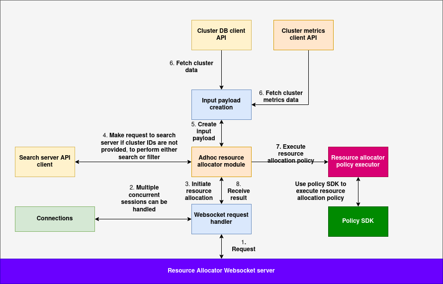

# Resource Allocator server
The Resource Allocator Server provides an environment to execute custom resource allocation policies and hosts a WebSocket server that modules responsible for resource allocation can connect to for real-time interaction.

Given a resource allocation policy and a set of input parameters (described in later sections), the Resource Allocator Server executes the policy by supplying the required inputs and returns the most suitable cluster, node, and GPUs to run the specified workloads.

The Resource Allocator Server is designed to be generic and extensible, allowing users to implement and plug in their own custom resource allocation logic.

---

## Architecture of Resource allocator:



### Basic flow:

1. The payload is received over the WebSocket connection.  
2. If a predefined list of cluster IDs is provided, those clusters are used as potential candidates for resource allocation.  
3. If a predefined list of cluster IDs is not available, the user can supply either a filter or a similarity search query (refer to the parser documentation for the structure of filter and similarity search queries).  
4. If a filter or similarity search query is provided, the Resource Allocator Server queries the Search Server to retrieve a candidate pool of clusters based on the criteria.  
5. The Resource Allocator Server uses the Cluster Metrics API and the Cluster Registry to fetch the current cluster metrics and metadata.  
6. It then loads and initializes the resource allocation policy locally, passing the Cluster DB API and Cluster Metrics DB API client instances as add-ons to the policy (see the documentation below for more details).  
7. The resource allocation policy is executed using the cluster data and metrics obtained in step 5.  
8. The result is returned through the WebSocket connection.

---

## Using the websocket server:

Resource allocator server provides a websocket server instead of HTTP to account for the long waiting times of the responses in some cases (when the search space is large), the applications/developer clients that need to use resource allocator should implement a websocket client and wait on the websocket for the reception of data.

The WebSocket server expects clients to send a JSON-encoded message with the following structure when performing resource allocation:

```json
{
  "adhoc": true,
  "policy_rule_uri": "string",
  "clusters": [/* optional list of clusters */],
  "inputs": { /* required input parameters */ },
  "filter": { /* optional filter criteria */ },
  "search": { /* optional search criteria */ },
  "parameters": { /* optional parameters to customize allocation */ },
  "settings": { /* optional execution settings */ }
}
```

### Field Descriptions

| Field             | Type        | Required | Description |
|------------------|-------------|----------|-------------|
| `adhoc`          | `boolean`   | Yes      | Must be set to `true`. |
| `policy_rule_uri`| `string`    | Yes      | The URI must point to a policy in the policy DB, this policy will be used for resource allocation |
| `clusters`       | `array`     | No       | Optional list of cluster IDs if the list of clusters are already known |
| `filter`         | `object`    | No       | Filter query can be passed in this field if the list of clusters are not known |
| `search`         | `object`    | No       | Similarity search query can be passed in this field if the list of clusters are not known |
| `inputs`         | `object`    | Yes      | The inputs payload specific to the policy being used for resource allocation |
| `parameters`     | `object`    | No       | Parameters to the resource allocator policy overriding defaults |
| `settings`       | `object`    | No       | Parameters to the resource allocator policy overriding defaults |


### Python websocket example:

```python
import asyncio
import websockets
import json
import logging

logging.basicConfig(level=logging.INFO)

async def send_resource_allocation_request():
    uri = "ws://<server-url>:8765" 

    sample_payload = {
        "adhoc": True,
        "policy_rule_uri": "",
        "clusters": [],
        "inputs": {},
        "filter": {},
        "search": {},
        "parameters": {},
        "settings": {}
    }

    try:
        async with websockets.connect(uri) as websocket:
            # Send request
            await websocket.send(json.dumps(sample_payload))
            logging.info("Request sent to server.")

            # Wait for response
            response = await websocket.recv()
            logging.info(f"Response received: {response}")

    except Exception as e:
        logging.error(f"Error in WebSocket client: {e}")

# Run the client
if __name__ == "__main__":
    asyncio.run(send_resource_allocation_request())
```
---

## Writing the resource allocator policy:

Here is the basic structure of a policy template (taken from policies system documentation)

```python
class AIOSv1PolicyRule:
    def __init__(self, rule_id, settings, parameters):
        """
        Initializes an AIOSv1PolicyRule instance.

        Args:
            rule_id (str): Unique identifier for the rule.
            settings (dict): Configuration settings for the rule.
            parameters (dict): Parameters defining the rule's behavior.
        """
        self.rule_id = rule_id
        self.settings = settings
        self.parameters = parameters

    def eval(self, parameters, input_data, context):
        """
        Evaluates the policy rule.

        Args:
            parameters (dict): The current parameters.
            input_data (any): The input data to be evaluated.
            context (dict): Context (external cache), this can be used for storing and accessing the state across multiple runs.

        Returns:
            dict: A dictionary with the evaluation result and possibly modified input_data.
        """
        # Rule logic goes here (can modify input_data)
        return {}
       
    def management(self, action: str, data: dict) -> dict:
        """

        (management need not be implemented for this policy)

        Executes a custom management command.

        This method enables external interaction with the rule instance for purposes such as:
        - updating settings or parameters
        - fetching internal state
        - diagnostics or lifecycle control

        Args:
            action (str): The management action to execute.
            data (dict): Input payload or command arguments.

        Returns:
            dict: A result dictionary containing the status and any relevant details.
        """
        # Implement custom management actions here
        pass

```

#### Structure of `input_data`:

The `input_data` passed to the policy's `eval` method contains following fields:

```
{
                "cluster_data": <key: cluster_id>, <value: data and cluster_metrics>,
                "inputs": <the input dict passed in the websocket payload - specific to the policy>
}
```

Here is the sample structure of `cluster_data` field:

```
{
    "cluster-0": {
        "data": <cluster-data>,
        "cluster_metrics": <cluster-metrics>
    },
    "cluster-1": {
        "data": <cluster-data>,
        "cluster_metrics": <cluster-metrics>
    }
}
```

| Key               | Type     | Description |
|------------------|----------|-------------|
| `cluster-0`, `cluster-1`, ... | `string` | Unique identifier for each cluster. |
| `data`           | `dict`   | Static metadata about the cluster (e.g., labels, hardware, configuration). |
| `cluster_metrics`| `dict`   | Real-time metrics for the cluster (e.g., GPU availability, load, memory usage). |

**Note**:
**1. For the structure of `data` refer to the structure of the cluster document in Cluster DB docs.**

**2. For the structure of `cluster_metrics` refer to the structure of the Metrics System docs.**

#### Using cluster metrics API and cluster data API:
Resource allocator server injects the cluster metrics API client and cluster data API client objects by default into the settings of the policy so it can be used inside the policy rule:

```python
settings.update({
    'cluster_client': self.cluster_client,
    'cluster_metrics_client': self.metrics_client
})
```

Here are the class definitions of cluster client and cluster metrics client:

**1. Cluster client**

```python
class ClusterClient:
    def __init__(self):
        self.base_url = os.getenv(
            "CLUSTER_SERVICE_URL", "http://<server-url>:3000")

    def read_cluster(self, cluster_id):
        try:
            response = requests.get(f"{self.base_url}/clusters/{cluster_id}")
            response.raise_for_status()
            return True, response.json()
        except requests.exceptions.HTTPError as http_err:
            return False, f"HTTP error occurred: {http_err}"
        except Exception as err:
            return False, f"Error occurred: {err}"

    def execute_query(self, query):
        try:
            response = requests.post(
                f"{self.base_url}/clusters/query", json={"query": query})
            response.raise_for_status()
            return True, response.json()
        except requests.exceptions.HTTPError as http_err:
            return False, f"HTTP error occurred: {http_err}"
        except Exception as err:
            return False, f"Error occurred: {err}"
```

**2. Cluster metrics client:**
```python
class GlobalClusterMetricsClient:
    def __init__(self):
        self.base_url = os.getenv("GLOBAL_CLUSTER_METRICS_URL", "http://<server-url>:8888").rstrip('/')
        logger.info(
            f"GlobalClusterMetricsClient initialized with base URL: {self.base_url}")

    def _handle_response(self, response):
        try:
            response.raise_for_status()
            json_data = response.json()
            if not json_data.get("success", False):
                raise APIError(json_data.get(
                    "error", "Unknown error"), response.status_code)
            return json_data.get("data")
        except requests.RequestException as e:
            logger.error(f"HTTP error: {e}")
            raise
        except ValueError as e:
            logger.error(f"Invalid JSON response: {e}")
            raise

    def get_cluster(self, cluster_id):
        url = f"{self.base_url}/cluster/{cluster_id}"
        response = requests.get(url)
        return self._handle_response(response)

    def query_clusters(self, query_params=None):
        url = f"{self.base_url}/cluster/query"
        response = requests.get(url, params=query_params)
        return self._handle_response(response)
```

You can access these objects inside the policy as follows:

```python
# example to access clusters API client:
cluster_client = self.settings['cluster_client']
cluster_client.read_cluster('cluster-123')

# example to access cluster metrics client:
cluster_metrics_client = self.settings['cluster_metrics_client']
cluster_metrics_client.get_cluster('cluster-123')

```

#### Output format:
The policy should emit the output in following format for each allocation request in the input:

```
{
    "cluster_id": <cluster_id>,
    "node_id": <node_id> (optional),
    "gpus": [<gpu_id>] (optional)
}
```

Example:
```json
{
    "cluster_id": "cluster-123", // in cluster-123
    "node_id": "node-0", // use node-0
    "gpus": ["0", "2"] // use GPU 0 and 2 in node-0
}
```


